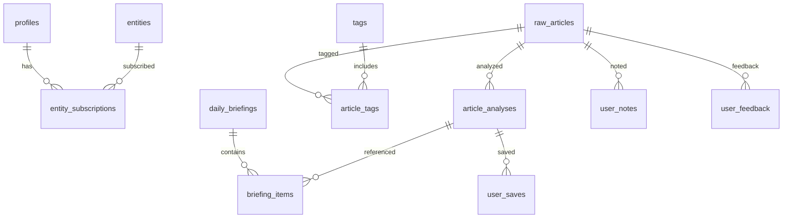

# ContentRSS Backend API + Supabase 数据库设计（对齐 PRD v3.0）

> **目的**：基于现有 PRD 与高保真蓝图，落地后端接口与 Supabase 数据关系  
> **Auth**：使用 Supabase Auth（`auth.users`）  
> **数据源**：继续使用现有 Special API 拉取公众号数据  
> **AI 结果**：必须落库（可回溯）

---

## 1. 架构概要（数据流）

```
Special API (公众号) 
   ↓ Ingest
raw_articles (原始文章)
   ↓ Analyze (LLM)
article_analyses (情报卡片)
   ↓ Assemble
daily_briefings / briefing_items
   ↓ Serve
/api/intelligence /api/article /api/briefing
```

**关键原则**
- 读接口允许“访客模式”，写接口需要 Auth
- AI 分析结果**不覆盖旧记录**，以版本形式保留

---

## 2. 角色与偏好（可选）

角色（Lens）不是强依赖，但建议落一个轻量结构，支持“通用流 vs 角色流”的分发逻辑。

- `profiles.primary_lens` 为空时＝通用流
- `profiles.lenses[]` 保存多角色选择
- `profiles.tag_keys[]` 保存关注标签（或 `profile_tags` 表）

---

## 3. 核心表设计（Supabase / Postgres）

> 下面给出 SQL DDL，可直接用于 Supabase SQL Editor。

```sql
-- 1) 用户资料（与 Auth 绑定）
create table if not exists profiles (
  user_id uuid primary key references auth.users(id) on delete cascade,
  primary_lens text,
  lenses text[] default '{}',
  tag_keys text[] default '{}',
  created_at timestamp with time zone default now(),
  updated_at timestamp with time zone default now()
);

-- 2) 实体（Radar）
create table if not exists entities (
  id text primary key,
  name text not null,
  type text not null, -- company / industry / topic
  icon text,
  subscriber_count int default 0,
  created_at timestamp with time zone default now()
);

create table if not exists entity_subscriptions (
  user_id uuid references auth.users(id) on delete cascade,
  entity_id text references entities(id) on delete cascade,
  created_at timestamp with time zone default now(),
  primary key (user_id, entity_id)
);

-- 3) 原始文章（公众号）
create table if not exists raw_articles (
  id bigint generated by default as identity primary key,
  source_name text,
  source_url text unique,
  title text,
  summary text,
  content text,
  category_key text,
  raw_payload jsonb,
  published_at timestamp with time zone,
  ingested_at timestamp with time zone default now()
);

-- 4) AI 分析（情报卡片）
create table if not exists article_analyses (
  id uuid primary key default gen_random_uuid(),
  article_id bigint references raw_articles(id) on delete cascade,
  polarity text not null, -- positive / negative / neutral
  fact text,
  impacts jsonb,          -- [{entity, trend, reason}]
  opinion text,
  tags text[] default '{}',
  model_name text,
  prompt_version text,
  is_current boolean default true,
  created_at timestamp with time zone default now()
);

-- 5) 标签体系（可选扩展）
create table if not exists tags (
  id uuid primary key default gen_random_uuid(),
  key text unique,
  name text,
  level text, -- category / ai / user
  icon text,
  color text,
  owner_user_id uuid references auth.users(id),
  created_at timestamp with time zone default now()
);

create table if not exists article_tags (
  article_id bigint references raw_articles(id) on delete cascade,
  tag_id uuid references tags(id) on delete cascade,
  primary key (article_id, tag_id)
);

-- 6) Daily Briefing
create table if not exists daily_briefings (
  id uuid primary key default gen_random_uuid(),
  date date not null,
  title text,
  subtitle text,
  read_time text,
  synthesis text,
  takeaways text[] default '{}',
  framework jsonb,
  impact_chain jsonb,
  created_at timestamp with time zone default now()
);

create table if not exists briefing_items (
  briefing_id uuid references daily_briefings(id) on delete cascade,
  analysis_id uuid references article_analyses(id) on delete cascade,
  position int,
  primary key (briefing_id, analysis_id)
);

-- 7) 用户资产（Save/Notes）
create table if not exists user_saves (
  id uuid primary key default gen_random_uuid(),
  user_id uuid references auth.users(id) on delete cascade,
  analysis_id uuid references article_analyses(id) on delete cascade,
  created_at timestamp with time zone default now()
);

create table if not exists user_notes (
  id uuid primary key default gen_random_uuid(),
  user_id uuid references auth.users(id) on delete cascade,
  article_id bigint references raw_articles(id) on delete cascade,
  content text not null,
  highlights jsonb, -- 高亮段落/引用
  related_entities text[] default '{}',
  created_at timestamp with time zone default now(),
  updated_at timestamp with time zone default now()
);

-- 8) 用户反馈（左滑/打开/分享）
create table if not exists user_feedback (
  id uuid primary key default gen_random_uuid(),
  user_id uuid references auth.users(id) on delete cascade,
  article_id bigint references raw_articles(id) on delete cascade,
  action text not null, -- ignored / opened / shared
  created_at timestamp with time zone default now()
);
```

---

## 4. 关系图（ER 逻辑）



---

## 5. API 设计（与现有前端保持兼容）

> 统一的 REST 层建议继续保留 `api/*` 路径，便于前端无痛切换。

### 5.1 读接口（访客可读）

**GET `/api/intelligence`**  
Query: `limit`, `lens`, `tag_keys[]`, `skip_ai`  
Resp:
```json
{ "count": 5, "cards": [ { "id": 1, "title": "...", "polarity": "negative", "fact": "...", "impacts": [], "opinion": "", "tags": [], "source_name": "", "source_url": "" } ] }
```

**GET `/api/article/:id`**  
Resp:
```json
{ "id": 1, "title": "...", "polarity": "neutral", "fact": "...", "impacts": [], "opinion": "", "tags": [], "source_name": "", "source_url": "", "content": "...", "summary": "{\"thesis\":\"...\",\"facts\":[],\"sentiment\":\"neutral\"}" }
```

**GET `/api/briefing/daily`**  
Query: `date`, `lens`  
Resp: DailyBriefing 结构（`top_picks` = analyses）

**GET `/api/entities`**  
Resp: Radar 列表（带订阅状态）

**GET `/api/tags`**  
Resp: 系统标签 + 用户标签（如有）

---

### 5.2 写接口（需要 Auth）

**POST `/api/onboarding`**  
Body:
```json
{ "primary_lens": "运营", "lenses": ["运营","增长"], "tag_keys": ["医美","品牌"] }
```

**POST `/api/entities/toggle/:id`**  
Body: `{}`  
Resp: `{ "entity_id": "...", "is_subscribed": true }`

**POST `/api/saves`**  
Body: `{ "analysis_id": "uuid" }`

**POST `/api/notes`**  
Body: `{ "article_id": 1, "content": "...", "highlights": [] }`

**POST `/api/feedback`**  
Body: `{ "article_id": 1, "action": "ignored" }`

---

### 5.3 内部任务接口（Service Role）

**POST `/api/ingest/sync`**  
拉取 Special API → 写入 `raw_articles`

**POST `/api/analyze/:article_id`**  
生成新 `article_analyses`（旧 `is_current` 置为 false）

---

## 6. RLS 建议（Supabase）

**开放读**
- `raw_articles`、`article_analyses`：允许 public select（或仅 via backend）

**用户私有**
- `profiles`、`user_saves`、`user_notes`、`user_feedback`：仅本人读写

**订阅**
- `entity_subscriptions`：仅本人读写  

---

## 7. 与 PRD/设计对齐点

- Top 5：`/api/intelligence?limit=5`  
- 角色分流：`profiles.primary_lens` 空则通用流  
- AI 分析落库：`article_analyses` 可保留历史  
- 笔记即资产：`user_notes` + `user_saves`

