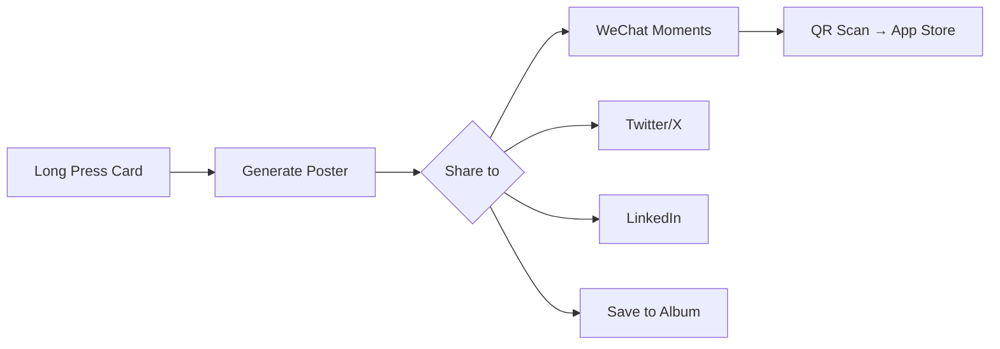

# ContentRSS Growth Strategy

> **Version**: 1.0 | **Last Updated**: 2024-12-24
> **Expert Source**: SkillsMP Growth Hacking + Product Manager

---

## 1. AARRR Framework (Pirate Metrics)

```
┌───────────────────────────────────────────────────────┐
│                    ACQUISITION                        │
│  How do users discover ContentRSS?                    │
├───────────────────────────────────────────────────────┤
│                    ACTIVATION                         │
│  What is the "Aha Moment"?                            │
├───────────────────────────────────────────────────────┤
│                    RETENTION                          │
│  Why do users come back daily?                        │
├───────────────────────────────────────────────────────┤
│                    REFERRAL                           │
│  How do users share with others?                      │
├───────────────────────────────────────────────────────┤
│                    REVENUE                            │
│  How do we monetize?                                  │
└───────────────────────────────────────────────────────┘
```

---

## 2. Acquisition 获客策略

### 2.1 Viral Poster (核心增长引擎)

| 设计元素 | 增长价值 |
|:---|:---|
| **品牌水印** | 每张海报底部 "via ContentRSS" + Logo |
| **一键生成** | 降低分享阻力，< 3秒完成 |
| **高颜值模板** | 值得分享的社交货币 |
| **Deep Link** | 海报扫码直达 App Store |

**UI 设计要求**:
```
┌─────────────────────────────────────┐
│                                     │
│   [ Intelligence Poster Content ]   │
│                                     │
├─────────────────────────────────────┤
│  📰 ContentRSS          [QR Code]  │
│  Industry Intelligence              │
└─────────────────────────────────────┘
```

### 2.2 SEO-Ready Briefing

- Daily Briefing 生成 Web 版本
- 可索引、可分享的公开 URL
- 长尾关键词："{行业} + 情报 + 日报"

---

## 3. Activation 激活策略

### 3.1 Aha Moment 定义

> **用户首次在 TL;DR 中发现与自身相关的行业情报**

**触发条件**:
- 订阅至少 1 个实体
- 阅读完第一个 Daily Briefing TL;DR
- 时间 < 用户首次打开后 24 小时

### 3.2 Onboarding UX 优化

| Step | 设计要求 | 转化目标 |
|:---|:---|:---|
| Welcome | 展示价值主张 "高信号情报" | > 95% 继续 |
| Interests | 3-5 个可点选兴趣标签 | 选择 ≥ 1 |
| Radar | 推荐热门实体 (预勾选 3 个) | 订阅 ≥ 3 |
| Notification | 解释 "每日简报推送" 价值 | > 60% 允许 |

### 3.3 首次体验增强

- **首张卡片高亮**：引导用户点击体验 Article Detail
- **AI 问答 Stub**：预置 "Ask about this" 按钮，降低使用门槛
- **成功反馈**：完成首次全流程后 Confetti 动画

---

## 4. Retention 留存策略

### 4.1 Daily Briefing 推送

| 时间 | 内容 | 目标 |
|:---|:---|:---|
| 8:00 AM | "今日情报简报已就绪" | 建立习惯 |
| 6:00 PM | "今日热点回顾" | 第二次触达 |
| Weekly | "本周 Top 5 情报" | 周活唤醒 |

### 4.2 个性化 Radar

- **学习用户行为**：阅读 > 3 次的实体自动推荐订阅
- **雷达更新通知**："LVMH 有新情报"
- **订阅趋势**："42K 人正在追踪 OpenAI"

### 4.3 Streak & Gamification

```
┌─────────────────────────────────────┐
│  🔥 7 天阅读连续              [i]  │
│  ███████░░░  70% to badge          │
└─────────────────────────────────────┘
```

---

## 5. Referral 推荐策略

### 5.1 Viral Poster 分享路径



### 5.2 社交证明

| 元素 | 位置 | 内容 |
|:---|:---|:---|
| Follower Count | Entity Row | "42K 人正在追踪" |
| Trending Badge | Card | "🔥 Trending in AI" |
| Share Count | Article Detail | "分享 1.2K 次" |

### 5.3 Invite Flow (Future)

```
[Profile] → [Invite Friends] → [Generate Invite Link]
                                       ↓
                            "邀请 3 位好友解锁 Pro 功能"
```

---

## 6. Revenue 变现策略

### 6.1 Freemium Model

| Feature | Free | Pro |
|:---|:---|:---|
| Daily Briefing | ✅ | ✅ |
| Intelligence Cards | 10/day | Unlimited |
| Entity Radar | 5 entities | Unlimited |
| AI Ask | 3 questions/day | Unlimited |
| Viral Poster | Watermark | No Watermark |
| Export PDF | ❌ | ✅ |

### 6.2 Premium UI 预留

**Paywall 触发点**:
1. 超过每日限额时弹出 Soft Paywall
2. 尝试使用 Pro 功能时引导升级

**UI 设计**:
```
┌─────────────────────────────────────┐
│                                     │
│          ⭐ ContentRSS Pro          │
│                                     │
│  • Unlimited AI questions           │
│  • Remove watermarks                │
│  • Export briefings as PDF          │
│                                     │
│  ¥98/month  or  ¥588/year (省50%)   │
│                                     │
│       [Start 7-Day Free Trial]      │
│                                     │
└─────────────────────────────────────┘
```

---

## 7. Growth Metrics Dashboard

| Metric | Definition | Target |
|:---|:---|:---|
| **DAU** | Daily Active Users | Week-over-week +5% |
| **D1 Retention** | % return Day 1 | > 40% |
| **D7 Retention** | % return Day 7 | > 20% |
| **L7 Engagement** | 7日内活跃天数 | ≥ 3 days |
| **Viral K-Factor** | 每用户带来新用户数 | > 0.5 |
| **ARPU** | Average Revenue Per User | ¥15/month |

---

## 8. A/B Test Ideas

| Hypothesis | Variant A | Variant B |
|:---|:---|:---|
| 首页首张卡片引导 | 无引导 | 高亮 + Tooltip |
| Daily Briefing 推送时机 | 8:00 AM | 7:30 AM |
| Paywall 时机 | 第 3 次限额 | 第 5 次限额 |
| Viral Poster CTA | "Share" | "生成海报" |
