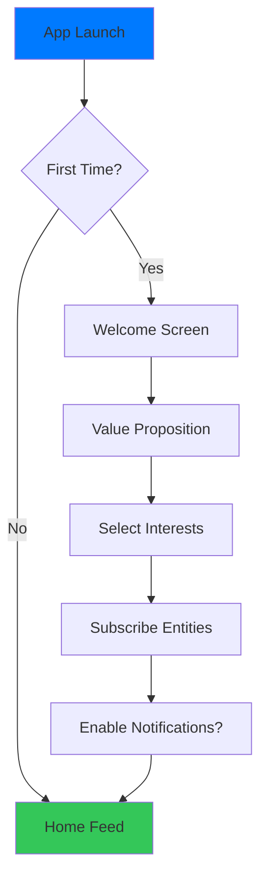
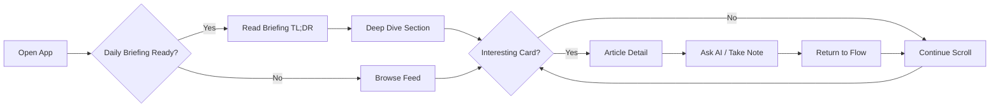
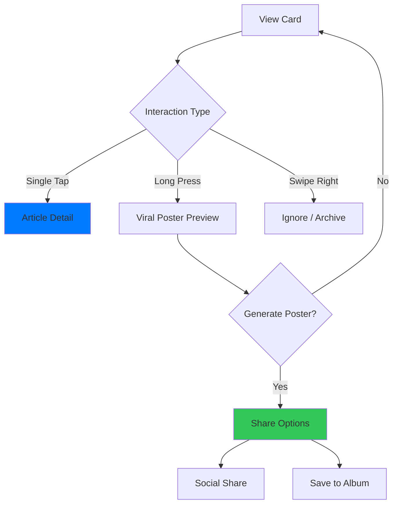
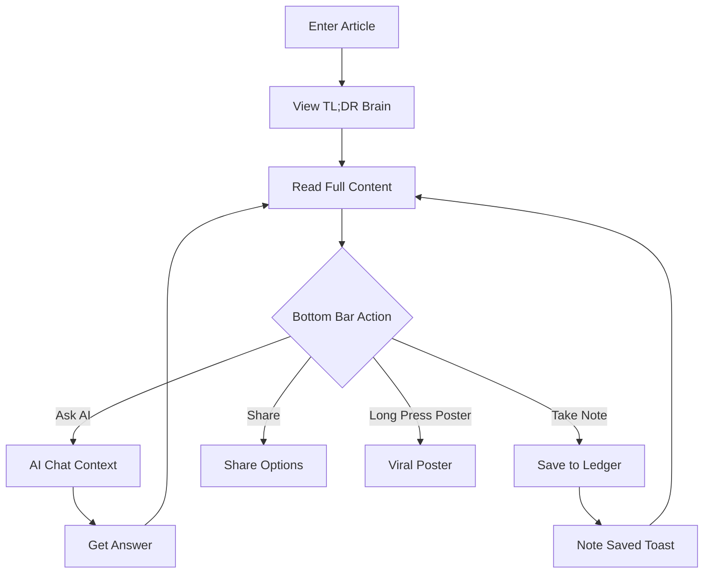
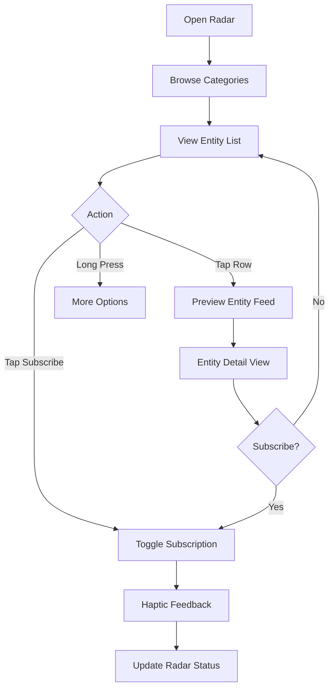
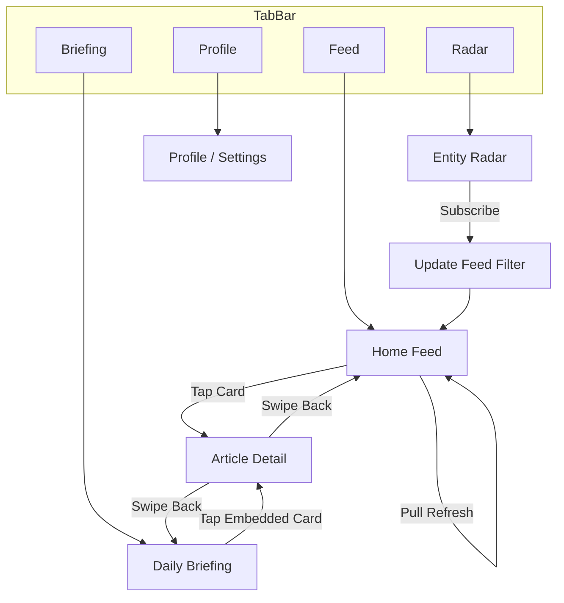

# ContentRSS User Flows

> **Version**: 1.0 | **Last Updated**: 2024-12-24
> **Expert Source**: `interaction-design-science` + Product Manager

---

## 1. Core User Flows

### 1.1 First-Time User Onboarding



**Key Metrics**:
- Completion Rate > 85%
- Time to First Value (TTFV) < 60s
- Entities Subscribed ≥ 3

---

### 1.2 Daily Reading Flow



**Aha Moment**: 用户在 TL;DR 中发现与自身相关的情报时

---

### 1.3 Intelligence Card Interaction



---

### 1.4 Article Detail Deep Dive



---

### 1.5 Entity Radar Subscription



---

## 2. Error & Edge Cases

### 2.1 Network Error Flow

```
┌─────────────────────────────────────┐
│          [Offline Banner]           │
│  "You're offline. Showing cached."  │
├─────────────────────────────────────┤
│                                     │
│     Cached Intelligence Cards       │
│                                     │
│  ┌─────────────────────────────┐    │
│  │ Card with "Cached" badge    │    │
│  └─────────────────────────────┘    │
│                                     │
│         [Retry Button]              │
│                                     │
└─────────────────────────────────────┘
```

### 2.2 Empty State Flows

| Page | Empty State | CTA |
|:---|:---|:---|
| Home Feed | "No intelligence yet" | Browse Trending |
| Entity Radar | "Your radar is empty" | Browse Entities |
| Daily Briefing | "No briefing today" | Browse Feed Instead |
| Search Results | "No matches found" | Try Different Keywords |

---

## 3. Notification Flows

### 3.1 Push Notification → Article

```
[Push: Breaking: LVMH Q4 earnings surprise]
                ↓
         Open App at Article Detail
                ↓
         Read → Ask AI → Back to Feed
```

### 3.2 Daily Briefing Reminder

```
[Push: Your Dec 24 briefing is ready 📰]
                ↓
         Open App at Daily Briefing
                ↓
         Read TL;DR → Deep Dive
```

---

## 4. Cross-Page Navigation



---

## 5. Success Metrics by Flow

| Flow | Key Metric | Target |
|:---|:---|:---|
| Onboarding | Completion Rate | > 85% |
| Daily Reading | Session Duration | > 5 min |
| Card Interaction | Tap-through Rate | > 30% |
| Article Detail | AI Ask Rate | > 15% |
| Radar Subscription | Entities per User | ≥ 5 |
| Viral Poster | Share Rate | > 10% |
