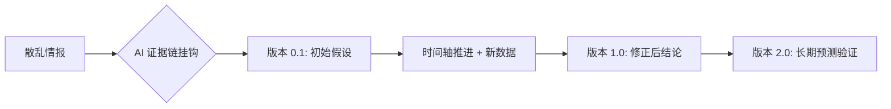
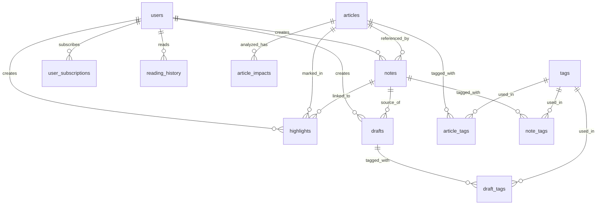

# ContentRSS UI 设计规格文档

> **版本**: 8.0 | **定位**: 个人情报操作系统 (LifeOS) · 堡垒型知识库 | **日期**: 2024-12-24

---

## 💎 设计哲学：从“垃圾堆”到“堡垒” (Fortress Philosophy)

借鉴 Gwern Branwen 的深度研究理念，ContentRSS 的核心设计准则：

### 1. 动态演进 (Dynamic Evolution)
*   **非一次性快照**: 无论是简报还是笔记，默认都是“活文档”。
*   **版本历史**: 支持追踪内容的修订、追加数据与实验结果（Version 0.1 → 1.0 → ...）。

### 2. 极致证据密度 (Evidence Density)
*   **证据链强迫症**: 每一个 AI 生成的结论必须附带“证据来源”。
*   **UI 触点**: 点击结论直接高亮原文信源，展示计算过程或统计偏误。

### 3. 长期预测与回溯 (Long-term Prediction)
*   **数字下注**: 支持对行业趋势进行“预测存档”，几年后自动弹出“后验检讨”。
*   **真理花园**: 不追求永远正确，追求逻辑重现与证伪。



---

## 🔄 内容闭环逻辑 (The Content Loop)

为了实现 50W 投入的价值最大化，ContentRSS 不仅仅是一个阅读器，而是一个**堡垒型情报生产系统**。

### 1. 发现 (Discover - 原始信源)
*   **动作**: 垂直频道聚合。
*   **设计**: 极高的信息密度，SF Symbols 快速识别。
*   **价值**: 降低获取优质信息的门槛。

### 2. 捕捉与沉淀 (Capture & Fortress - 证据挂钩)
*   **动作**: 高亮并挂载“逻辑链”。
*   **设计**: **Evidence Linker**，允许用户手动或 AI 自动将结论与论文/数据挂钩。
*   **价值**: 将公域信息转化为“经得起时间考验”的私域堡垒。

### 3. 合成与演进 (Synthesize & Evolve - 动态文档)
*   **动作**: AI 辅助修订旧笔记。当有新情报入库时，自动提示：“这与你 21 年的某条笔记矛盾，建议更新”。
*   **设计**: **History Timeline**，展示单个知识砖块的长达数年的演进脉络。
*   **价值**: 笔记不仅在变多，更在“长大”。

### 4. 发布与下注 (Publish & Betting - 公开作品)
*   **动作**: 带着“证据链”的一键分发。
*   **设计**: 发布时自动附带“参考文献”与“预测模型”。
*   **价值**: 将思考写在时间轴上，建立个人/机构的深度专业信任。

---

## 1. 堡垒首页：长期研究主题 (Research Topics)

> **定位**: 这不是即时新闻流，而是你的“在建工程列表”。

### 页面结构

```
┌─────────────────────────────────────┐
│ 🏗️ 在建堡垒 (Active Research) [🔍]  │  Header
├─────────────────────────────────────┤
│ ┌─────────────────────────────────┐ │
│ │ � 长期课题：玻色因国产化进程    │ │  主题卡片
│ │    最后更新：2小时前 (v2.4)      │ │
│ │    🧱 新增 3 块证据             │ │
│ └─────────────────────────────────┘ │
├─────────────────────────────────────┤
│ ┌─────────────────────────────────┐ │
│ │ 📖 长期课题：李佳琦选品逻辑      │ │
│ │    最后更新：昨天 (v1.1)         │ │
│ └─────────────────────────────────┘ │
├─────────────────────────────────────┤
│ 🗑️ 废弃区 (No Value Noise)         │
│    今日过滤掉 42 篇垃圾推文         │
└─────────────────────────────────────┘
```

---

## 2. 证据提取台 (Evidence Bench)

> **定位**: 将原始公众号推文“加工”为证据砖块的地方。

### 交互逻辑
*   **输入**: 一篇原始公众号推文。
*   **动作**: 
    1.  **Highlighter**: AI 自动高亮包含数据/事实的段落。
    2.  **Linker**: 点击高亮段落，选择“归入课题”。
    3.  **Snapshot**: 系统自动截图该段落并存档，防止原链接失效。

---

## 3. 主题时间轴 (Topic Timeline)

> **定位**: 展示一个课题的“生长过程”。

### 页面结构
```
# 课题：玻色因国产化进程

## v2.4 (2024-12-24)
*   **新证据**: 欧莱雅财报显示中国区高端线增速放缓 [🔗证据]
*   **修正判断**: 之前认为“国产无法替代”的观点可能过时，因为...

## v1.0 (2023-05-12)
*   **初始假设**: 玻色因核心专利过期，国产将迎来爆发。
*   [🔗证据: 专利局公告]
```

### 页面结构（紧凑版）

```
┌─────────────────────────────────────┐
│ [情报中心]          [🔍] [头像]     │  Header
├─────────────────────────────────────┤
│ [📋全部][⚖️法律][💻数字][💎品牌]→  │  统一分类标签
├─────────────────────────────────────┤
│ ┌─────────────────────────────────┐ │
│ │ 📰 今日简报              NEW  → │ │  简报入口
│ └─────────────────────────────────┘ │
├─────────────────────────────────────┤
│ ┌─────────────────────────────────┐ │  紧凑卡片
│ │ 🟢 情报标题...        来源 [▼] │ │  （折叠态）
│ └─────────────────────────────────┘ │
│ ┌─────────────────────────────────┐ │
│ │ 🔴 另一条情报标题...   来源 [▼] │ │
│ └─────────────────────────────────┘ │
│ ┌─────────────────────────────────┐ │  紧凑卡片
│ │ 🟢 第三条情报          来源 [▲] │ │  （展开态）
│ ├─────────────────────────────────┤ │
│ │ 核心洞察描述...                 │ │
│ │ [🟢实体A] [🔴实体B] ← 影响链   │ │
│ │ ✨ AI 观点...                   │ │
│ │ [标签1] [标签2] [标签3]         │ │
│ └─────────────────────────────────┘ │
│                                     │
│ [ 更多紧凑卡片... ]                 │
└─────────────────────────────────────┘
```

### 统一分类标签（与数据中心一致）

| Key | 名称 | 图标 | 颜色 |
|:---|:---|:---|:---|
| `all` | 全部 | 📋 | — |
| `legal` | 法律法规 | ⚖️ | `#6366F1` |
| `digital` | 数字化 | 💻 | `#0EA5E9` |
| `brand` | 品牌 | 💎 | `#EC4899` |
| `rd` | 新品研发 | 🧪 | `#8B5CF6` |
| `global` | 国际形势 | 🌍 | `#14B8A6` |
| `insight` | 行业洞察 | 📊 | `#F59E0B` |
| `ai` | AI | 🤖 | `#10B981` |
| `management` | 企业管理 | 📋 | `#64748B` |

### 紧凑卡片设计

#### 折叠态（默认）

| 元素 | 规格 |
|:---|:---|
| **高度** | 56px（单行） |
| **内边距** | 16px 水平，12px 垂直 |
| **极性指示** | 32×32px 圆角方块 |
| **标题** | 15px 字号，单行截断 |
| **展开按钮** | 32×32px 触摸区域 |

#### 展开态（点击后）

| 元素 | 触发 |
|:---|:---|
| **核心洞察** | 显示 `core_insight` 字段 |
| **影响链** | 横向 Chip 展示 `impacts[]` |
| **AI 观点** | 左边框引用样式 |
| **标签** | 横向排列 |

### 情报卡片内容

| 字段 | 说明 |
|:---|:---|
| **极性标签** | 正面 🟢 / 负面 🔴 / 中性 ⚪ |
| **核心事实** | 去除废话，只留核心数据 |
| **影响链** | `📈 受益` `📉 受损` 关系 |
| **AI 观点** | 第三方客观分析 |

---

## 2. 雷达 (追踪)

### 核心价值
> 追踪特定公司/人物的全部动态

（不再赘述，与原设计一致）

---

## 3. 简报 (阅读)

### 核心价值
> 每天 8:00 生成一份深度聚合简报

### 页面结构

```
┌─────────────────────────────────────┐
│ � 12月24日 · 星期二                │
│                                     │
│ � 今日美妆行业内参                 │
│    5 分钟读懂 Top 3 趋势            │
│ ─────────────────────────────────── │
│                                     │
│ ## 1. 玻色因价格战                  │
│ 随着国产替代... (点击查看原文)      │
│                                     │
│ ## 2. 抖音渠道变革                  │
│ ...                                 │
│                                     │
└─────────────────────────────────────┘
```

---

## 4. 个人助手 (LifeOS)

（见 V2.0 实施计划）

---

## 数据库设计（专家视角）

### 数据库选型分析

| 选项 | 优点 | 缺点 | 推荐场景 |
|:---|:---|:---|:---|
| **SQLite** | 零配置、嵌入式、文件即数据库 | 并发写入弱、无网络访问 | 本地开发/原型验证 |
| **PostgreSQL** | JSONB 原生支持、扩展性强、开源 | 运维复杂度中等 | 生产级部署（推荐）|
| **MySQL** | 社区广泛、生态成熟 | JSON 支持较弱 | 传统 Web 应用 |
| **Supabase** | PostgreSQL + Auth + API 一站式 | 付费/依赖云服务 | 快速 MVP |

> **专家建议**：推荐 **PostgreSQL** 或 **Supabase**，原因：
> 1. `drafts.published_platforms` 使用 JSON 类型，PostgreSQL JSONB 性能最优
> 2. 标签系统需要复杂查询，PostgreSQL 索引能力强
> 3. 未来扩展 AI 向量搜索，PostgreSQL 支持 pgvector

### 表结构概览（12 张表）

```
┌─────────────────────────────────────────────────────────┐
│                    ContentRSS 数据模型                   │
├─────────────────────────────────────────────────────────┤
│                                                         │
│  用户层                                                 │
│  ├── users (用户基础信息)                               │
│  ├── user_subscriptions (实体雷达订阅)                   │
│  └── reading_history (阅读记录)                         │
│                                                         │
│  内容层                                                 │
│  ├── articles (情报/文章)                               │
│  ├── article_tags (文章-标签关联)                       │
│  └── article_impacts (AI 分析影响链)                    │
│                                                         │
│  笔记层                                                 │
│  ├── notes (笔记)                                       │
│  ├── note_tags (笔记-标签关联)                          │
│  └── highlights (高亮/删除线标记)                       │
│                                                         │
│  创作层                                                 │
│  ├── drafts (草稿/发布文章)                             │
│  └── draft_tags (草稿-标签关联)                         │
│                                                         │
│  基础设施                                               │
│  └── tags (统一标签库)                                  │
│                                                         │
└─────────────────────────────────────────────────────────┘
```

### 核心表设计决策

| 决策 | 依据 |
|:---|:---|
| **标签三层结构** | `category(固定8个)` → `ai(AI生成)` → `user(用户自定义)`，支持多来源标签 |
| **AI 分析字段内嵌** | `articles` 表直接存储 `polarity/core_insight/catalyst` 等，避免 JOIN |
| **影响链独立表** | `article_impacts` 1:N 关系，支持动态数量和排序 |
| **JSON 存储发布信息** | `drafts.published_platforms` 使用 JSON，灵活存储多平台 |
| **软删除用 SET NULL** | 用户删除时关联笔记保留，`ON DELETE SET NULL` |

### ER 关系图



### 索引策略

| 表 | 索引 | 查询场景 |
|:---|:---|:---|
| `articles` | `idx_category, idx_polarity, idx_created_at` | 分类筛选、极性过滤、时间排序 |
| `notes` | `idx_user, idx_article` | 用户笔记列表、文章关联笔记 |
| `highlights` | `idx_user_article` | 用户在特定文章的高亮 |
| `drafts` | `idx_user_status` | 用户草稿箱分状态查询 |

## 设计 Token 速查

| Token | 值 |
|:---|:|
| 主背景色 | `#FAF9F6` (Paper Cream) |
| 正面 | `#10B981` (Emerald) |
| 负面 | `#EF4444` (Rose) |
| 中性 | `#71717A` (Zinc) |
| 主文字 | `#1A1A1A` |
| 圆角-卡片 | `24px` |
| 触摸区域 | ≥44pt |
