# ContentRSS Master PRD v3.0 (Unified)

> **Status**: Final (Unified)
> **Date**: 2025-12-25
> **Scope**: 统一定位 + 体验闭环 + 设计/规格入口

---

## 0. 文档入口 (Single Source of Truth)

**产品定位与核心需求（本文件）**
- `docs/master_prd_v3.md`
- 已将所有关联文档全文合并至本文件末尾的 Appendix，便于一次性查看与交付。

**设计规格与系统**
- UI 设计规格：`docs/design/ui-spec.md`
- 设计系统 Tokens：`docs/design-system/design-tokens.md`
- 组件规格：`docs/design-system/component-spec.md`
- 用户流程：`docs/design-system/user-flows.md`
- 增长策略：`docs/design-system/growth-strategy.md`

**V2 设计与落地映射**
- 设计概念：`docs/v2-design/design_v2.md`
- 功能/页面地图：`docs/v2-design/feature_map.md`
- 实施计划：`docs/v2-design/implementation_plan.md`
- 交付总结：`docs/v2-design/walkthrough.md`

**后端与数据规范**
- Supabase API + DB 设计：`docs/backend/api-db-spec.md`

**功能级 Specs**
- 情报引擎：`specs/001-intelligence-engine/spec.md`
- 详情页与传播：`specs/002-detail-and-viral/spec.md`
- 实体雷达：`specs/003-entity-radar/spec.md`
- 叙事简报：`specs/004-editorial-briefing/spec.md`
- Lenny 风格：`specs/005-lenny-style/spec.md`

**工程/智能体规则（非产品定位）**
- `docs/agent-evolution/GEMINI.md`

---

## 1. 定位与价值主张

### 1.1 一句话定位
ContentRSS 是把公众号等公域内容炼成“可决策情报”的行业参谋系统，让专业人士每天 8 分钟掌握真正重要的 5 件事。

### 1.2 目标用户（核心 Persona）
- **Sarah（CEO/高管）**：关注定价权、竞品大动作、行业政策风向。
- **Dr. Li（研究/技术负责人）**：关注技术路线、学术与产业化动态。
- **财务负责人/财务分析**：关注现金流风险、供应链冲击、政策与成本变化。
- **研发同学/工程师**：关注技术路线变化、关键突破、竞品迭代节奏。
- **银行从业者**：关注行业风险、企业重大事件、宏观政策信号。

### 1.3 竞争定位（核心差异）
- **vs 科技媒体（36Kr/虎嗅）**：剔除软文与正确的废话，提供决策价值而非阅读消费。
- **vs 阅读工具（语鲸类）**：不止摘要，输出“影响链”与判断。
- **vs 电商情报通**：不做战术指标，而做战略动向与行业趋势。

---

## 2. 三大核心需求（Final）

### 2.1 极高信噪比（Signal-to-Noise）
**目标**：今天全网信息里，只有 5 件值得你知道。

**落地机制**
- **Hard Cap**：默认只展示 Top 5（其余折叠）。
- **极性门槛**：必须具备明确利好/利空/中性信号才进入主视野。
- **反馈训练**：左滑“不感兴趣”持续提纯偏好。

### 2.2 信息源破壁（Phased）
**当前现实**：数据源以公众号为主。  
**策略**：分阶段扩展，避免虚假“多源”。

**Phase 1（现在）**
- 公众号作为唯一 P0 数据源。
- 卡片底部展示来源元数据（作者/公众号）。

**Phase 2（下一阶段）**
- 引入 36Kr/虎嗅/外媒/研报/X 等多源。
- 卡片支持多来源聚合展示（“来源：公众号 + 研报 + 外媒”）。

### 2.3 结构化摘要（升级版）
**旧期望**：背景 + 核心事件 + 行业影响 + 辣评  
**最终标准**：极性 + 事实核 + 影响链 + AI 观点（可选）

**为什么升级**
- 行业用户不需要背景科普，直接给事实与影响。
- 去掉“网友/专家辣评”，避免噪音与不可控主观意见。
- 用“影响链”替代“辣评”，更可验证、更可决策。

**统一摘要 Schema（P0）**
| 模块 | 内容 | 说明 |
| --- | --- | --- |
| 极性 | Bullish/Bearish/Neutral | 快速信号灯 |
| 事实核 | 2 句话内的核心事实 | 只留硬信息 |
| 影响链 | Entity → Trend → Reason | 逻辑推演 |
| AI 观点 | 1 句可选锐评 | 可关闭 |

---

## 3. 核心体验模块

### 3.1 Intelligence Feed（情报卡片）
- 情报卡片是原子单位，不是文章。
- 一眼看到：极性 + 事实核 + 影响链。
- 长按触发分享海报（带水印）。

### 3.2 Article Detail（The Brain）
- AI 导读置顶：一行结论 + 关键事实 + 情绪/极性仪表盘。
- 阅读模式：衬线体 + 大行高。

### 3.3 Entity Radar（订阅雷达）
- 订阅实体/行业/人物，驱动个性化排序。
- “My Radar” 模式优先推送订阅相关。

### 3.4 Daily Briefing（叙事简报）
- Lenny Style：Lead → TL;DR → Framework → Deep Dive → Closing。
- 将碎片卡片编织成可执行叙事。

### 3.5 Viral Poster（增长引擎）
- 长按卡片生成海报。
- 默认水印：`Internal / Insiders Only`。

### 3.6 Data Center（原始数据）
- 原始文章与字段透视，用于校验信源与内容完整性。
- 仅展示，不参与主体验排序（可作为内测/内部入口）。
- 底部 Tab 直接入口，默认展示分类列表与原始字段。

---

## 4. 关键交互画面（UI 确认）

1. **情报卡片**：第一眼看到极性信号 + 加粗事实核。
2. **分享动作**：长按弹出高质海报，带“Internal/Insiders Only”水印。
3. **无感入场**：访客可直接浏览；当触发收藏/笔记时再要求登录。

---

## 5. 留存系统（Second Brain）

### 5.1 收藏（Save）
- 收藏的不是“文章”，而是**当时的 AI 判断**。

### 5.2 笔记（Notes）
- 支持高亮与写想法。
- 笔记自动关联到实体标签，形成可回溯的“个人观点轨迹”。

---

## 6. 体验闭环（Content Loop）

```
Ingest → Analyst → Intelligence Card → Briefing
         ↓                              ↓
     Radar偏好  ←  Notes/Save  ←  分享海报
```

**设计哲学支撑**
- Fortress Philosophy：证据密度、动态演进、可回溯。
- 不追求“内容多”，追求“判断可用”。

---

## 7. 数据与 AI 分析（当前实现对齐代码）

**数据源（P0 现实）**
- 公众号为唯一输入源（Special API 拉取）。
- `/api/raw-data` 返回分组后的原始公众号数据（分类维度）。

**原始数据结构（/api/raw-data 真实字段）**
- 返回结构：`{ category, label, count, items[] }`
- `items[]` 真实字段：
  - `record_id`：源记录 ID
  - `fields`：业务字段容器
  - `fields.文章信息`：JSON 字符串，包含 `{ 摘要, 作者名称, 文章标题, 文章URL }`
  - `fields.文章标题-moss用`：标题备份字段
  - `fields.自增ID`：原始递增 ID
- **设计可用字段映射**：
  - 标题：`文章信息.文章标题` → 兜底 `文章标题-moss用`
  - 摘要：`文章信息.摘要`
  - 来源：`文章信息.作者名称`
  - 原文：`文章信息.文章URL`

**Data Center 展示口径（高保真需落图）**
- 折叠态卡片（列表默认展示）：
  - 标题（文章信息.文章标题 / 兜底字段）
  - 摘要（1–2 行，文章信息.摘要）
  - 来源与 ID（作者名称 + 自增ID）
  - 原文入口（文章URL，图标按钮）
- 展开态（点击卡片/展开按钮）：
  - `文章信息` 全量字段 Key-Value
  - 其它 `fields` 原始字段（如 record_id、文章标题-moss用）
- 缺失字段策略：显示 “-” 并保持行高稳定

**AI 分析方式（Python）**
- `backend/main.py` 调用 `backend/prompts/analyst_v1.md` 生成结构化输出。
- 输出字段：`polarity`、`fact`、`impacts[]`、`opinion`、`tags[]`。
- `/api/intelligence` 聚合各分类（每类最多 3 条）并返回情报卡片。

**情报卡片字段（/api/intelligence 真实字段）**
- 返回结构：`{ count, cards[] }`
- `cards[]` 字段：`id`, `title`, `polarity`, `fact`, `impacts`, `opinion`, `tags`, `source_name`, `source_url`
- **退化策略**：
  - AI 失败/关闭时：`impacts` 为空、`opinion` 为空，UI 需隐藏或显示占位文案
  - `source_name/source_url` 为空时，UI 不展示来源模块

**分类映射与标签页（P0）**
- 标签 key → label：
  - `legal` 法律法规
  - `digital` 数字化
  - `brand` 品牌
  - `rd` 新品研发
  - `global` 国际形势
  - `insight` 行业洞察
  - `ai` AI
  - `management` 企业管理
- 标签切换触发接口：
  - Feed：`GET /api/intelligence?category=legal`
  - 原始数据页：`GET /api/raw-data?category=legal`

**已存在的“决策信息”字段**
- 极性（Polarity）
- 事实核（Fact）
- 影响链（Impacts）
- 观点（Opinion）

**当前缺口（需补齐）**
- Top 5 的“硬限制”尚未在后端排序中实现。
- 角色 Lens 的排序/字段显隐逻辑尚未进入后端。
- 详情页的 The Brain 结构（thesis/facts/sentiment）在主 API 中未标准化输出。

---

## 8. 设计系统与视觉原则（摘要）

- **视觉基调**：Paper Cream 背景 + Serif 标题（可读性与权威感）。
- **交互基调**：Haptic + Motion 提升“工具质感”。
- **组件核心**：Intelligence Card、The Brain、Poster、Briefing Flow。

详细规范见设计系统文档（见“文档入口”）。

---

## 9. 关键用户流程（摘要）

- **Onboarding**：角色可选 → 兴趣选择 → 订阅实体 → 进入 Feed（跳过角色=通用流）。
- **每日阅读**：Briefing TL;DR → 重点卡片 → 深度详情。
- **情报反馈**：滑动忽略 → 影响下一次排序。
- **深度沉淀**：收藏/笔记 → 关联实体 → 形成个人知识资产。

---

## 10. 交互原则与高级交互规范（Apple HIG + 交互科学）

**设计原则**
- **直接操作**：卡片可滑动/长按/点击，减少进入深层页面的成本。
- **强反馈**：关键动作配合 Haptic + 视觉反馈（Toast/Badge）。
- **一致性**：左滑=忽略、长按=分享、点击=详情，在全局保持一致。
- **渐进披露**：默认只展示 Top 5，展开后显示影响链与 AI 观点。
- **系统替用户承担复杂度**：默认智能排序，用户只需调整角色/标签。
- **可撤销**：忽略动作提供短暂 Undo（减少误操作焦虑）。
- **可达性**：触控目标 ≥ 44×44，重要操作置于底部栏。

**关键交互（P0 必须）**
| 场景 | 交互 | 反馈 |
| --- | --- | --- |
| Feed 卡片 | 点击进入详情 | 轻触感 + 卡片展开动效 |
| Feed 卡片 | 左滑忽略 | 位移+渐隐+Undo |
| Feed 卡片 | 长按分享 | 海报预览弹出 |
| Lens 切换 | 横向滑动选择 | 卡片重新排序 |
| Detail | 底部栏操作 | 触感 + 状态提示 |
| Notes | 保存/高亮 | “已保存”标记 |

**空状态与异常**
- 离线：展示缓存卡片 + 重试按钮
- 无结果：提示调整标签/订阅

---

## 11. 增长策略与商业化（Business Growth）

**AARRR 路径**
- **Acquisition**：分享海报 + Briefing Web 分享页
- **Activation**：首次 TL;DR 命中个人兴趣（Aha Moment）
- **Retention**：Daily Briefing 推送 + Radar 更新提醒
- **Referral**：海报水印 + Deep Link
- **Revenue**：Freemium（AI 问答、雷达上限、去水印）

**增长引擎（P0）**
- Viral Poster：长按即生成，默认水印
- 访客模式：无感浏览，资产动作触发登录
- Radar 订阅：提高回访与推送粘性

**商业化触发**
- 超额使用 AI 问答
- 超出订阅实体上限
- 去水印/导出需求

**指标（首月重点）**
- D1/D7 留存
- Daily Briefing 打开率
- 分享海报转化率
- 角色选择转化率

---

## 12. MVP 范围与阶段

### P0（现在必须）
- 公众号数据摄取与清洗。
- 情报卡片（极性 + 事实核 + 影响链）。
- Daily Briefing（叙事结构）。
- Entity Radar（订阅 + 基础过滤）。
- Notes/Save（留存资产）。
- Viral Poster（带水印）。
- 访客模式与“收藏触发登录”。

### P1（下一阶段）
- 多源破壁（36Kr/虎嗅/外媒/研报/X）。
- 重要性评分与权重排序。
- 证据链接与来源对照。

---

## 13. 验收标准（Design Audit Checklist）

- **信噪比**：默认 Top 5 + 折叠策略生效。
- **结构化摘要**：每张卡片满足统一 Schema。
- **来源透明**：来源元数据清晰展示。
- **留存闭环**：收藏与笔记能形成可回溯资产。
- **增长闭环**：长按海报可分享、带水印。
- **无感入场**：访客可浏览，登录只在资产动作触发。
- **交互一致性**：左滑忽略 / 长按分享 / 点击详情统一生效。
- **角色分流**：未选角色=通用流，选角色=Lens 生效。

---

## 14. 统一口径决议（解决历史冲突）

- **定位**：统一对外为“行业情报参谋 / Industry Intelligence OS”。  
  “堡垒型知识库”降级为内部的留存系统描述。
- **摘要结构**：以“极性 + 事实核 + 影响链 + AI 观点（可选）”为唯一标准。
- **多源策略**：明确 Phase 1 单源（公众号），Phase 2 再破壁。
- **滑动动作**：统一为“左滑忽略”。

---

## Appendix: Unified Docs (Snapshot)

本节为 `docs/` 与 `specs/` 下所有文档的全文合并快照，方便一次性查阅与交付。

<!-- BEGIN FULL DOCS MERGE -->


---

## Source: `docs/agent-evolution/AGENT_EVOLUTION_DESIGN.md`

# Agent 自进化系统设计方案

## 1. 核心理念

**"用 Agent 迭代 Skills"** = 让 AI 自己分析自己的表现，然后自动优化自己的"工作说明书"，从而在没有人工干预的情况下变得越来越专业。

## 2. 问题背景

传统 AI Agent 的能力提升路径：
- 等模型厂商发布新版本
- 手工编写更多 Prompt
- 依赖人类总结经验

**问题**：知识存在对话中，过期就丢失；每次会话从零开始。

## 3. 设计目标

建立一个**持续学习的闭环系统**：

```
Agent 执行任务 → 发现更优实践/踩坑 → 更新 Skills/GEMINI.md
        ↑                                          ↓
        └───────── 下次任务自动应用新规则 ─────────┘
```

## 4. 实现机制

### 4.1 行为规则 (写入 GEMINI.md)

```markdown
**技能自进化 (Skill Evolution)**

> **持续沉淀**：每次会话结束前，主动反思是否有值得沉淀的经验
> **优先内化**：如果某类错误反复出现，必须将修正逻辑写入 Skills
> **反思清单**：会话结束前自查——①踩坑？②更优实践？③用户纠正？
```

### 4.2 进化日志 (Evolution Log)

| 日期 | 更新内容 | 来源 | 影响范围 |
|:---|:---|:---|:---|
| 2025-12-24 | Playwright `:has()` 选择器用法 | 踩坑 | webapp-testing |
| 2025-12-24 | 背景色检测应查容器而非 body | 踩坑 | webapp-testing |

### 4.3 Skills 文件结构

```
~/.claude/skills/
├── webapp-testing/
│   └── SKILL.md  ← 包含"进化记录"章节
├── frontend-expert/
│   └── SKILL.md  ← 包含"进化记录"章节
└── ...
```

## 5. 触发场景

| 场景 | 应更新的内容 |
|:---|:---|
| 发现更好的组件写法 | → 更新 `frontend-expert` Skill |
| 测试时踩了 Playwright 坑 | → 更新 `webapp-testing` Skill |
| 发现 gemini.md 缺失的规则 | → 直接补充 `GEMINI.md` |
| 用户多次纠正输出格式 | → 更新 `chinese-output` Skill |

## 6. 理论基础

### 6.1 RLHF (Reinforcement Learning from Human Feedback)
用户的正向反馈（LGTM/纠正）等同于 RLHF 中的"人类标注"。

### 6.2 知识管理 SECI 模型
```
隐性知识（踩坑） → 显性化（写入Skills） → 组合化（整合体系） → 内化（自动应用）
```

## 7. 与 ContentRSS 的关联

在 ContentRSS V2 中，我们建立了类似的闭环：
- 用户的 Ask AI 追问 → 反馈信号
- 用户的 Note 笔记 → 显性知识
- Feed 的侧滑忽略 → 隐性反馈
- `SkillMetadata.refinement_score` → 量化进化程度

详见 [specs/intelligence/skill_evolution.md](../specs/intelligence/skill_evolution.md)

## 8. 首次实践记录

**2025-12-24 本次会话的进化成果**：

1. 在 `GEMINI.md` 中新增"技能自进化"规则
2. 在 `GEMINI.md` 中建立"进化日志"记录表
3. 在 `webapp-testing/SKILL.md` 中新增 Playwright 踩坑经验
4. 在 `frontend-expert/SKILL.md` 中新增组件可测试性规则

---

> 这是一个**元系统**——它定义了 Agent 如何定义自己。

---

## Source: `docs/agent-evolution/GEMINI.md`

**核心理念与原则**

> **简洁至上**：恪守KISS（Keep It Simple, Stupid）原则，崇尚简洁与可维护性，避免过度工程化与不必要的防御性设计。
> **深度分析**：立足于第一性原理（First Principles Thinking）剖析问题，并善用工具以提升效率。
> **事实为本**：以事实为最高准则。若有任何谬误，恳请坦率斧正，助我精进。

**开发工作流**

> **渐进式开发**：通过多轮对话迭代，明确并实现需求。在着手任何设计或编码工作前，必须完成前期调研并厘清所有疑点。
> **结构化流程**：严格遵循“构思方案 → 提请审核 → 分解为具体任务”的作业顺序。

> **Spec-Driven (Spec-Kit)**：严格遵循 Spec-First 原则。任何功能开发前，必须在 `specs/{feature_id}/` 下创建规范文档（spec.md, data-model.md, api-spec.json, plan.md）。
> **契约先行**：`api-spec.json` (OpenAPI) 是前后端协作的唯一真理，必须在编码前定义并冻结。
**输出规范**

> **语言要求**：所有回复、思考过程及任务清单，均须使用中文。
> **固定指令**：`Implementation Plan, Task List and Thought in Chinese`
**技能自进化 (Skill Evolution)**

> **持续沉淀**：每次会话结束前，主动反思是否有值得沉淀的经验（踩坑、更优实践、用户纠正），并更新相应的 `~/.claude/skills/` 文件或本全局规则。
> **优先内化**：如果某类错误反复出现，必须将修正逻辑写入 Skills，避免重复犯错。
> **反思清单**：会话结束前自查——①本次踩了什么坑？②发现了什么更优实践？③用户纠正了哪些错误？→ 决定是否更新 Skills。

> **事实为本**：以事实为最高准则。若有任何谬误，恳请坦率斧正，助我精进。

---

### 🚨 1.1 强制自检清单 (Mandatory Checklist)

> **任务启动前 (Must Execution Before First Tool Call)**：
> - [ ] **领域识别**：明确涉及的技术栈（FastAPI/React/SignalR 等）与业务模块。
> - [ ] **知识召回**：通过 `view_file` 激活相关 KI (Knowledge Items) 与历史 ADR。
> - [ ] **同步规格**：检查 `specs/` 目录下是否有挂钩的 Delta 规格文档。
> - [ ] **更新 Task**：在 `task.md` 中分解任务，并同步 `task_boundary`。

> **任务完成后 (Check-Out & Evolution)**：
> - [ ] **反思沉淀**：识别本次任务踩过的“坑”或更优的“模式”。
> - [ ] **数据入库**：更新 `GEMINI.md` 的进化日志或生成/更新相关的 KI 档案。
> - [ ] **证据采集**：在 `walkthrough.md` 中附带可测试、可回溯的证据。
> - [ ] **闭环自迭代**：确认本次交付是否符合 Spec-Kit 3.0 的可持续演进标准。

---

## 进化日志 (Evolution Log)

> 每次更新 Skills 或本文件时，追加一条记录。

| 日期 | 更新内容 | 来源 | 影响范围 |
|:---|:---|:---|:---|
| 2025-12-24 | 新增"技能自进化"规则 | 用户建议 | GEMINI.md |
| 2025-12-24 | Playwright `:has()` 选择器用法修正 | 踩坑 | webapp-testing |
| 2025-12-24 | 背景色检测应查容器而非 body | 踩坑 | webapp-testing |
| 2025-12-25 | 建立 Spec-Kit 3.0 交付协议 | 架构演进 | 全局 |
| 2025-12-25 | 引入 Expert Panel 设计审计机制 | 用户要求 | 全局 |
| 2025-12-25 | 弃用 CompactCard，回归 IntelligenceCard 核心设计 | 专家审计 | ContentRSS |
| 2025-12-25 | 建立强制自检协议（Pre/Post Task Check） | 用户要求 | 全局规范 |

---

## Source: `docs/agent-evolution/README.md`

# Agent 自进化 (Agent Evolution) 文档集

本目录包含 Agent 自进化系统的设计思想与实现方案。

## 📁 文档清单

| 文件 | 内容 |
|:---|:---|
| [GEMINI.md](./GEMINI.md) | Agent 行为宪法（核心理念、开发工作流、技能自进化规则） |
| [AGENT_EVOLUTION_DESIGN.md](./AGENT_EVOLUTION_DESIGN.md) | 自进化系统设计方案（理论基础、实现机制、首次实践记录） |

## 🔗 相关文件

- [specs/intelligence/skill_evolution.md](../specs/intelligence/skill_evolution.md) - 在 ContentRSS 中的具体落地规范
- `~/.claude/skills/` - Skills 技能库（在本地，非项目内）

## 💡 核心理念

> **"用 Agent 迭代 Skills"** = 让 AI 自己分析自己的表现，然后自动优化自己的"工作说明书"，从而在没有人工干预的情况下变得越来越专业。

## 📊 进化闭环

```
Agent 执行任务 → 发现更优实践/踩坑 → 更新 Skills/GEMINI.md
        ↑                                          ↓
        └───────── 下次任务自动应用新规则 ─────────┘
```

---

## Source: `docs/backend/api-db-spec.md`

# ContentRSS Backend API + Supabase 数据库设计（对齐 PRD v3.0）

> **目的**：基于现有 PRD 与高保真蓝图，落地后端接口与 Supabase 数据关系  
> **Auth**：使用 Supabase Auth（`auth.users`）  
> **数据源**：继续使用现有 Special API 拉取公众号数据  
> **AI 结果**：必须落库（可回溯）

---

## 1. 架构概要（数据流）

```
Special API (公众号) 
   ↓ Ingest
raw_articles (原始文章)
   ↓ Analyze (LLM)
article_analyses (情报卡片)
   ↓ Assemble
daily_briefings / briefing_items
   ↓ Serve
/api/intelligence /api/article /api/briefing
```

**关键原则**
- 读接口允许“访客模式”，写接口需要 Auth
- AI 分析结果**不覆盖旧记录**，以版本形式保留

---

## 2. 角色与偏好（可选）

角色（Lens）不是强依赖，但建议落一个轻量结构，支持“通用流 vs 角色流”的分发逻辑。

- `profiles.primary_lens` 为空时＝通用流
- `profiles.lenses[]` 保存多角色选择
- `profiles.tag_keys[]` 保存关注标签（或 `profile_tags` 表）

---

## 3. 核心表设计（Supabase / Postgres）

> 下面给出 SQL DDL，可直接用于 Supabase SQL Editor。

```sql
-- 1) 用户资料（与 Auth 绑定）
create table if not exists profiles (
  user_id uuid primary key references auth.users(id) on delete cascade,
  primary_lens text,
  lenses text[] default '{}',
  tag_keys text[] default '{}',
  created_at timestamp with time zone default now(),
  updated_at timestamp with time zone default now()
);

-- 2) 实体（Radar）
create table if not exists entities (
  id text primary key,
  name text not null,
  type text not null, -- company / industry / topic
  icon text,
  subscriber_count int default 0,
  created_at timestamp with time zone default now()
);

create table if not exists entity_subscriptions (
  user_id uuid references auth.users(id) on delete cascade,
  entity_id text references entities(id) on delete cascade,
  created_at timestamp with time zone default now(),
  primary key (user_id, entity_id)
);

-- 3) 原始文章（公众号）
create table if not exists raw_articles (
  id bigint generated by default as identity primary key,
  source_name text,
  source_url text unique,
  title text,
  summary text,
  content text,
  category_key text,
  raw_payload jsonb,
  published_at timestamp with time zone,
  ingested_at timestamp with time zone default now()
);

-- 4) AI 分析（情报卡片）
create table if not exists article_analyses (
  id uuid primary key default gen_random_uuid(),
  article_id bigint references raw_articles(id) on delete cascade,
  polarity text not null, -- positive / negative / neutral
  fact text,
  impacts jsonb,          -- [{entity, trend, reason}]
  opinion text,
  tags text[] default '{}',
  model_name text,
  prompt_version text,
  is_current boolean default true,
  created_at timestamp with time zone default now()
);

-- 5) 标签体系（可选扩展）
create table if not exists tags (
  id uuid primary key default gen_random_uuid(),
  key text unique,
  name text,
  level text, -- category / ai / user
  icon text,
  color text,
  owner_user_id uuid references auth.users(id),
  created_at timestamp with time zone default now()
);

create table if not exists article_tags (
  article_id bigint references raw_articles(id) on delete cascade,
  tag_id uuid references tags(id) on delete cascade,
  primary key (article_id, tag_id)
);

-- 6) Daily Briefing
create table if not exists daily_briefings (
  id uuid primary key default gen_random_uuid(),
  date date not null,
  title text,
  subtitle text,
  read_time text,
  synthesis text,
  takeaways text[] default '{}',
  framework jsonb,
  impact_chain jsonb,
  created_at timestamp with time zone default now()
);

create table if not exists briefing_items (
  briefing_id uuid references daily_briefings(id) on delete cascade,
  analysis_id uuid references article_analyses(id) on delete cascade,
  position int,
  primary key (briefing_id, analysis_id)
);

-- 7) 用户资产（Save/Notes）
create table if not exists user_saves (
  id uuid primary key default gen_random_uuid(),
  user_id uuid references auth.users(id) on delete cascade,
  analysis_id uuid references article_analyses(id) on delete cascade,
  created_at timestamp with time zone default now()
);

create table if not exists user_notes (
  id uuid primary key default gen_random_uuid(),
  user_id uuid references auth.users(id) on delete cascade,
  article_id bigint references raw_articles(id) on delete cascade,
  content text not null,
  highlights jsonb, -- 高亮段落/引用
  related_entities text[] default '{}',
  created_at timestamp with time zone default now(),
  updated_at timestamp with time zone default now()
);

-- 8) 用户反馈（左滑/打开/分享）
create table if not exists user_feedback (
  id uuid primary key default gen_random_uuid(),
  user_id uuid references auth.users(id) on delete cascade,
  article_id bigint references raw_articles(id) on delete cascade,
  action text not null, -- ignored / opened / shared
  created_at timestamp with time zone default now()
);
```

---

## 4. 关系图（ER 逻辑）

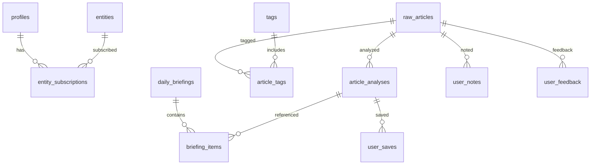

---

## 5. API 设计（与现有前端保持兼容）

> 统一的 REST 层建议继续保留 `api/*` 路径，便于前端无痛切换。

### 5.1 读接口（访客可读）

**GET `/api/intelligence`**  
Query: `limit`, `category`, `lens`, `tag_keys[]`, `skip_ai`  
Resp:
```json
{ "count": 5, "cards": [ { "id": 1, "title": "...", "polarity": "negative", "fact": "...", "impacts": [], "opinion": "", "tags": [], "source_name": "", "source_url": "" } ] }
```

**GET `/api/article/:id`**  
Resp:
```json
{ "id": 1, "title": "...", "polarity": "neutral", "fact": "...", "impacts": [], "opinion": "", "tags": [], "source_name": "", "source_url": "", "content": "...", "summary": "{\"thesis\":\"...\",\"facts\":[],\"sentiment\":\"neutral\"}" }
```

**GET `/api/briefing/daily`**  
Query: `date`, `lens`  
Resp: DailyBriefing 结构（`top_picks` = analyses）

**GET `/api/entities`**  
Resp: Radar 列表（带订阅状态）

**GET `/api/tags`**  
Resp: 系统标签 + 用户标签（如有）

---

### 5.2 写接口（需要 Auth）

**POST `/api/onboarding`**  
Body:
```json
{ "primary_lens": "运营", "lenses": ["运营","增长"], "tag_keys": ["医美","品牌"] }
```

**POST `/api/entities/toggle/:id`**  
Body: `{}`  
Resp: `{ "entity_id": "...", "is_subscribed": true }`

**POST `/api/saves`**  
Body: `{ "analysis_id": "uuid" }`

**POST `/api/notes`**  
Body: `{ "article_id": 1, "content": "...", "highlights": [] }`

**POST `/api/feedback`**  
Body: `{ "article_id": 1, "action": "ignored" }`

---

### 5.3 内部任务接口（Service Role）

**POST `/api/ingest/sync`**  
拉取 Special API → 写入 `raw_articles`

**POST `/api/analyze/:article_id`**  
生成新 `article_analyses`（旧 `is_current` 置为 false）

---

### 5.4 响应字段定义（Response Schema）

**通用错误响应**
| 字段 | 类型 | 必填 | 说明 |
| --- | --- | --- | --- |
| error | string | 是 | 错误信息 |

**Impact**
| 字段 | 类型 | 必填 | 说明 |
| --- | --- | --- | --- |
| entity | string | 是 | 影响对象 |
| trend | string | 是 | up / down |
| reason | string | 是 | 影响原因 |

**IntelligenceCard**
| 字段 | 类型 | 必填 | 说明 |
| --- | --- | --- | --- |
| id | number | 是 | 文章/卡片 ID |
| title | string | 是 | 标题 |
| polarity | string | 是 | positive / negative / neutral |
| fact | string | 是 | 事实核（2 句内） |
| impacts | Impact[] | 是 | 影响链 |
| opinion | string | 否 | AI 观点 |
| tags | string[] | 是 | 标签 |
| source_name | string | 否 | 来源名 |
| source_url | string | 否 | 来源链接 |

**IntelligenceResponse**
| 字段 | 类型 | 必填 | 说明 |
| --- | --- | --- | --- |
| count | number | 是 | 卡片数量 |
| cards | IntelligenceCard[] | 是 | 卡片列表 |

**The Brain Summary**
| 字段 | 类型 | 必填 | 说明 |
| --- | --- | --- | --- |
| thesis | string | 是 | 一行结论 |
| facts | string[] | 否 | 关键事实 |
| sentiment | string | 是 | bullish / bearish / neutral |

**ArticleDetailResponse**
| 字段 | 类型 | 必填 | 说明 |
| --- | --- | --- | --- |
| id | number | 是 | 文章 ID |
| title | string | 是 | 标题 |
| polarity | string | 是 | 极性 |
| fact | string | 是 | 事实核 |
| impacts | Impact[] | 是 | 影响链 |
| opinion | string | 否 | AI 观点 |
| tags | string[] | 是 | 标签 |
| source_name | string | 否 | 来源名 |
| source_url | string | 否 | 来源链接 |
| content | string | 是 | 正文 |
| summary | object|string | 是 | The Brain（建议对象；兼容 JSON 字符串） |
| original_url | string | 否 | 原文链接 |

**DailyBriefingResponse**
| 字段 | 类型 | 必填 | 说明 |
| --- | --- | --- | --- |
| date | string | 是 | yyyy-mm-dd |
| title | string | 是 | 标题 |
| subtitle | string | 否 | 副标题 |
| read_time | string | 是 | 预计阅读时长 |
| synthesis | string | 是 | 概述 |
| takeaways | string[] | 是 | TL;DR |
| top_picks | IntelligenceCard[] | 是 | 关键卡片 |
| impact_chain | object | 是 | { trigger, path[], conclusion } |
| framework | object | 否 | { type, title, nodes[] } |

**Entity**
| 字段 | 类型 | 必填 | 说明 |
| --- | --- | --- | --- |
| id | string | 是 | 实体 ID |
| name | string | 是 | 实体名 |
| type | string | 是 | company / industry / topic |
| icon | string | 否 | 图标 |
| subscriber_count | number | 是 | 订阅数 |
| is_subscribed | boolean | 是 | 是否订阅 |

**Tag**
| 字段 | 类型 | 必填 | 说明 |
| --- | --- | --- | --- |
| id | string | 是 | 标签 ID |
| name | string | 是 | 标签名 |
| key | string | 是 | 标签 key |
| level | string | 是 | category / ai / user |
| icon | string | 否 | 图标 |
| color | string | 否 | 颜色 |
| usageCount | number | 否 | 使用次数 |

**SaveResponse**
| 字段 | 类型 | 必填 | 说明 |
| --- | --- | --- | --- |
| id | string | 是 | 保存记录 ID |
| analysis_id | string | 是 | 分析卡片 ID |
| created_at | string | 是 | 创建时间 |

**NoteResponse**
| 字段 | 类型 | 必填 | 说明 |
| --- | --- | --- | --- |
| id | string | 是 | 笔记 ID |
| article_id | number | 是 | 文章 ID |
| content | string | 是 | 笔记内容 |
| highlights | object[] | 否 | 高亮段落 |
| related_entities | string[] | 否 | 关联实体 |
| created_at | string | 是 | 创建时间 |
| updated_at | string | 是 | 更新时间 |

**FeedbackResponse**
| 字段 | 类型 | 必填 | 说明 |
| --- | --- | --- | --- |
| id | string | 是 | 反馈 ID |
| article_id | number | 是 | 文章 ID |
| action | string | 是 | ignored / opened / shared |
| created_at | string | 是 | 创建时间 |

---

## 6. RLS 建议（Supabase）

**开放读**
- `raw_articles`、`article_analyses`：允许 public select（或仅 via backend）

**用户私有**
- `profiles`、`user_saves`、`user_notes`、`user_feedback`：仅本人读写

**订阅**
- `entity_subscriptions`：仅本人读写  

---

## 7. 与 PRD/设计对齐点

- Top 5：`/api/intelligence?limit=5`  
- 角色分流：`profiles.primary_lens` 空则通用流  
- AI 分析落库：`article_analyses` 可保留历史  
- 笔记即资产：`user_notes` + `user_saves`

---

## Source: `docs/design-system/component-spec.md`

# ContentRSS Component Specification

> **Version**: 1.0 | **Last Updated**: 2024-12-24
> **Expert Source**: `apple-hig-design` + `interaction-design-science`

---

## 1. Intelligence Card (核心原子)

### 1.1 Structure

```
┌─────────────────────────────────────┐
│ [Polarity Badge]     [Source Icon] │  ← Header (48px)
├─────────────────────────────────────┤
│ Headline Title (Serif, Bold)       │  ← Title (auto)
│                                     │
│ Summary text in 2-3 lines max...   │  ← Summary (auto)
├─────────────────────────────────────┤
│ Entity → Trend → Reason            │  ← Impact Chain (32px)
├─────────────────────────────────────┤
│ 12:30 PM · Reuters    [Share Icon] │  ← Footer (36px)
└─────────────────────────────────────┘
```

### 1.2 Specs

| Property | Value |
|:---|:---|
| **Width** | 100% (max 428px) |
| **Padding** | 20px |
| **Border Radius** | 12px |
| **Background** | `--color-surface` |
| **Shadow** | `--shadow-low` |
| **Touch Target** | 整卡片可点击 |

### 1.3 Polarity Badge

| State | Color | Icon |
|:---|:---|:---|
| Bullish | `#34C759` | 📈 Arrow Up |
| Bearish | `#FF3B30` | 📉 Arrow Down |
| Neutral | `#8E8E93` | ➖ Minus |

### 1.4 States

| State | Visual |
|:---|:---|
| Default | 白底 + 浅阴影 |
| Pressed | Scale 0.98 + 深阴影 |
| Long Press | 渐变边框 + 海报预览 |
| Swiped | 向右滑动 + 渐隐 |

---

## 2. Button

### 2.1 Variants

| Type | Background | Text | Border |
|:---|:---|:---|:---|
| **Filled** | `--color-accent` | White | None |
| **Tinted** | `--color-accent-tinted` | `--color-accent` | None |
| **Plain** | Transparent | `--color-accent` | None |
| **Gray** | `#F2F2F7` | `--color-text-primary` | None |

### 2.2 Sizes

| Size | Height | Padding | Font |
|:---|:---|:---|:---|
| **Large** | 50px | 24px | 17px Semibold |
| **Medium** | 44px | 16px | 15px Medium |
| **Small** | 32px | 12px | 13px Medium |

### 2.3 States

| State | Opacity | Transform |
|:---|:---|:---|
| Default | 1.0 | none |
| Hover | 0.9 | none |
| Pressed | 0.7 | scale(0.98) |
| Disabled | 0.4 | none |

### 2.4 Icon Button

```
┌───────┐
│  📤   │  ← 44×44px 触摸区域
│       │     24×24px 图标
└───────┘
```

---

## 3. Input Field

### 3.1 Structure

```
┌─────────────────────────────────────┐
│ Label                               │  ← 13px, Secondary
├─────────────────────────────────────┤
│ ┌─────────────────────────────────┐ │
│ │ Placeholder...                  │ │  ← 48px 高度
│ └─────────────────────────────────┘ │
│ Helper text or error message        │  ← 12px, Tertiary/Error
└─────────────────────────────────────┘
```

### 3.2 Specs

| Property | Value |
|:---|:---|
| **Height** | 48px |
| **Padding** | 12px 16px |
| **Border Radius** | 8px |
| **Border** | 1px solid `#E8E8E8` |
| **Focus Border** | 2px solid `--color-accent` |

### 3.3 States

| State | Border | Background |
|:---|:---|:---|
| Default | `#E8E8E8` | White |
| Focus | `--color-accent` | White |
| Error | `#FF3B30` | `#FFF5F5` |
| Disabled | `#F0F0F0` | `#F8F8F8` |

---

## 4. Modal / Sheet

### 4.1 Bottom Sheet

```
┌─────────────────────────────────────┐
│              ───────                │  ← Drag Handle (4×36px)
├─────────────────────────────────────┤
│ Sheet Title                    [×]  │  ← Header (56px)
├─────────────────────────────────────┤
│                                     │
│         Content Area                │  ← max-height: 80vh
│                                     │
├─────────────────────────────────────┤
│ [Secondary]          [Primary CTA]  │  ← Footer (68px + safe)
└─────────────────────────────────────┘
```

### 4.2 Specs

| Property | Value |
|:---|:---|
| **Border Radius** | 24px (top) |
| **Background** | `--color-surface` |
| **Backdrop** | `rgba(0,0,0,0.4)` |
| **Safe Area Bottom** | `env(safe-area-inset-bottom)` |

### 4.3 Gestures

| Gesture | Action |
|:---|:---|
| Drag Down | 关闭（阈值 > 120px） |
| Tap Backdrop | 关闭 |
| Swipe Content | 内部滚动 |

---

## 5. Tab Bar

### 5.1 Structure

```
┌─────────────────────────────────────┐
│   🏠      📡      📰      👤       │  ← 图标区 (24×24)
│  Feed   Radar  Briefing Profile    │  ← 标签区 (10px)
├─────────────────────────────────────┤
│              ━━━━━                  │  ← Home 指示器
└─────────────────────────────────────┘
```

### 5.2 Specs

| Property | Value |
|:---|:---|
| **Height** | 49px + safe area |
| **Background** | Blur + 80% white |
| **Border Top** | 0.5px `#C6C6C8` |
| **Icon Size** | 24×24px |
| **Label Size** | 10px Medium |

### 5.3 States

| State | Icon | Label |
|:---|:---|:---|
| Active | Filled + `--color-accent` | `--color-accent` |
| Inactive | Outlined + `#8E8E93` | `#8E8E93` |

---

## 6. Sentiment Gauge (极性仪表)

### 6.1 Structure

```
         Bearish ◀──────●──────▶ Bullish
         -100%         0%          +100%
```

### 6.2 Specs

| Property | Value |
|:---|:---|
| **Height** | 8px (bar) + 24px (labels) |
| **Gradient** | `#FF3B30` → `#8E8E93` → `#34C759` |
| **Indicator** | 12×12px 圆点 |

---

## 7. Impact Chain (影响链)

### 7.1 Structure

```
┌─────────┐    ┌─────────┐    ┌─────────┐
│ Event A │ →→ │ Impact  │ →→ │ Result  │
└─────────┘    └─────────┘    └─────────┘
```

### 7.2 Specs

| Property | Value |
|:---|:---|
| **Node Padding** | 8px 12px |
| **Node Radius** | 6px |
| **Node Background** | `#F2F2F7` |
| **Arrow** | `→` or SVG chevron |
| **Font** | 13px Medium |

---

## 8. Framework Visual (Matrix/Pyramid)

### 8.1 2×2 Matrix

```
┌─────────────┬─────────────┐
│   High/$    │   High/$    │
│   Low Risk  │  High Risk  │
├─────────────┼─────────────┤
│   Low/$     │   Low/$     │
│   Low Risk  │  High Risk  │
└─────────────┴─────────────┘
```

### 8.2 Pyramid

```
        ┌───────────┐
        │   Peak    │
      ┌─┴───────────┴─┐
      │    Middle     │
    ┌─┴───────────────┴─┐
    │      Base         │
    └───────────────────┘
```

---

## Accessibility Checklist

- [ ] 所有触摸目标 ≥ 44×44pt
- [ ] 颜色对比度 ≥ 4.5:1
- [ ] 动效支持 `prefers-reduced-motion`
- [ ] 焦点状态明显可见
- [ ] 语义化标签 (ARIA)

---

## Source: `docs/design-system/design-tokens.md`

# ContentRSS Design Tokens

> **Version**: 1.0 | **Last Updated**: 2024-12-24
> **Expert Source**: `apple-hig-design` + `frontend-design` + `brand-guidelines`

---

## 1. Color System

### 1.1 Brand Colors (Lenny Style)

| Token | Value | Usage |
|:---|:---|:---|
| `--color-background` | `#FAF9F6` | Paper Cream 主背景 |
| `--color-surface` | `#FFFFFF` | 卡片/模态框背景 |
| `--color-text-primary` | `#1A1A1A` | Dark charcoal 主文本 |
| `--color-text-secondary` | `#6B6B6B` | 次要文本 |
| `--color-text-tertiary` | `#9B9B9B` | 占位符/辅助文本 |

### 1.2 Semantic Colors

| Token | Value | Usage |
|:---|:---|:---|
| `--color-bullish` | `#34C759` | 看涨/积极信号 |
| `--color-bearish` | `#FF3B30` | 看跌/消极信号 |
| `--color-neutral` | `#8E8E93` | 中性信号 |
| `--color-accent` | `#007AFF` | 主要操作/链接 |
| `--color-accent-tinted` | `rgba(0,122,255,0.12)` | 浅色按钮背景 |

### 1.3 Dark Mode (Optional)

| Token | Light | Dark |
|:---|:---|:---|
| `--color-background` | `#FAF9F6` | `#1C1C1E` |
| `--color-surface` | `#FFFFFF` | `#2C2C2E` |
| `--color-text-primary` | `#1A1A1A` | `#FFFFFF` |
| `--color-separator` | `#E8E8E8` | `#38383A` |

---

## 2. Typography System

### 2.1 Font Families

| Token | Font Stack | Usage |
|:---|:---|:---|
| `--font-display` | `"Playfair Display", Georgia, serif` | 大标题/Lead |
| `--font-body` | `"Charter", "Lora", Georgia, serif` | 正文/叙事 |
| `--font-ui` | `"SF Pro", -apple-system, sans-serif` | UI 元素 |
| `--font-mono` | `"JetBrains Mono", "SF Mono", monospace` | 数据/代码 |

### 2.2 Type Scale (Apple HIG)

| Token | Size | Weight | Line Height | Usage |
|:---|:---|:---|:---|:---|
| `--text-large-title` | 34px | Bold | 1.2 | 页面主标题 |
| `--text-title-1` | 28px | Bold | 1.25 | 一级标题 |
| `--text-title-2` | 22px | Bold | 1.3 | 二级标题 |
| `--text-title-3` | 20px | Semibold | 1.35 | 三级标题 |
| `--text-headline` | 17px | Semibold | 1.4 | 卡片标题 |
| `--text-body` | 17px | Regular | 1.5 | 正文 |
| `--text-callout` | 16px | Regular | 1.45 | 辅助说明 |
| `--text-subhead` | 15px | Regular | 1.4 | 副标题 |
| `--text-footnote` | 13px | Regular | 1.35 | 脚注 |
| `--text-caption` | 12px | Regular | 1.3 | 图片说明 |
| `--text-data` | 10px | Medium | 1.2 | 原始数据 (Mono) |

---

## 3. Spacing System (4pt Grid)

| Token | Value | Usage |
|:---|:---|:---|
| `--space-1` | 4px | 紧凑内边距 |
| `--space-2` | 8px | 相关元素间距 |
| `--space-3` | 12px | 小组件间距 |
| `--space-4` | 16px | 标准内边距/外边距 |
| `--space-5` | 20px | 卡片内边距 |
| `--space-6` | 24px | 区块间距 |
| `--space-8` | 32px | 页面边距 |
| `--space-10` | 40px | 大区块分隔 |

### 3.1 Safe Areas (iOS)

| Token | Value | Description |
|:---|:---|:---|
| `--safe-top` | `env(safe-area-inset-top)` | 顶部刘海 |
| `--safe-bottom` | `env(safe-area-inset-bottom)` | 底部 Home 指示器 |
| `--content-max-width` | 428px | 最佳可读宽度 |

---

## 4. Elevation (Shadow)

| Token | Value | Usage |
|:---|:---|:---|
| `--shadow-low` | `0 1px 3px rgba(0,0,0,0.08)` | 卡片悬浮 |
| `--shadow-medium` | `0 4px 12px rgba(0,0,0,0.12)` | 模态框 |
| `--shadow-high` | `0 8px 24px rgba(0,0,0,0.16)` | 弹出层 |

---

## 5. Motion & Animation

### 5.1 Duration

| Token | Value | Usage |
|:---|:---|:---|
| `--duration-fast` | 100ms | 微交互（按钮状态） |
| `--duration-normal` | 200ms | 状态切换 |
| `--duration-slow` | 350ms | 页面转场 |
| `--duration-spring` | 500ms | 弹性动画 |

### 5.2 Easing Curves

| Token | Value | Usage |
|:---|:---|:---|
| `--ease-out` | `cubic-bezier(0, 0, 0.2, 1)` | 元素进入 |
| `--ease-in` | `cubic-bezier(0.4, 0, 1, 1)` | 元素退出 |
| `--ease-in-out` | `cubic-bezier(0.4, 0, 0.2, 1)` | 状态切换 |
| `--spring` | `cubic-bezier(0.175, 0.885, 0.32, 1.275)` | 弹性效果 |

### 5.3 Spring Config (Framer Motion)

```javascript
const springConfig = {
  damping: 20,
  stiffness: 300,
  mass: 0.8
};
```

---

## 6. Touch Targets (Apple HIG)

| Token | Value | Description |
|:---|:---|:---|
| `--touch-min` | 44px | 最小触摸区域 |
| `--touch-recommended` | 48px | 推荐触摸区域 |
| `--button-min-height` | 44px | 按钮最小高度 |
| `--icon-touch-padding` | 12px | 图标触摸扩展区 |

---

## 7. Border Radius

| Token | Value | Usage |
|:---|:---|:---|
| `--radius-xs` | 4px | 标签/徽章 |
| `--radius-sm` | 8px | 按钮/输入框 |
| `--radius-md` | 12px | 卡片 |
| `--radius-lg` | 16px | 模态框 |
| `--radius-xl` | 24px | 大卡片/Sheet |
| `--radius-full` | 9999px | 圆形按钮/头像 |

---

## 8. z-index Scale

| Token | Value | Usage |
|:---|:---|:---|
| `--z-base` | 0 | 基础层 |
| `--z-dropdown` | 100 | 下拉菜单 |
| `--z-sticky` | 200 | 吸顶导航 |
| `--z-modal` | 300 | 模态框 |
| `--z-toast` | 400 | Toast 提示 |
| `--z-tooltip` | 500 | Tooltip |

---

## Usage Example (CSS Variables)

```css
:root {
  /* Colors */
  --color-background: #FAF9F6;
  --color-text-primary: #1A1A1A;
  --color-accent: #007AFF;
  
  /* Typography */
  --font-display: "Playfair Display", Georgia, serif;
  --text-headline: 17px;
  
  /* Spacing */
  --space-4: 16px;
  
  /* Motion */
  --duration-normal: 200ms;
  --ease-out: cubic-bezier(0, 0, 0.2, 1);
}

.intelligence-card {
  background: var(--color-surface);
  padding: var(--space-5);
  border-radius: var(--radius-md);
  box-shadow: var(--shadow-low);
  transition: transform var(--duration-normal) var(--ease-out);
}
```

---

## Source: `docs/design-system/growth-strategy.md`

# ContentRSS Growth Strategy

> **Version**: 1.0 | **Last Updated**: 2024-12-24
> **Expert Source**: SkillsMP Growth Hacking + Product Manager

---

## 1. AARRR Framework (Pirate Metrics)

```
┌───────────────────────────────────────────────────────┐
│                    ACQUISITION                        │
│  How do users discover ContentRSS?                    │
├───────────────────────────────────────────────────────┤
│                    ACTIVATION                         │
│  What is the "Aha Moment"?                            │
├───────────────────────────────────────────────────────┤
│                    RETENTION                          │
│  Why do users come back daily?                        │
├───────────────────────────────────────────────────────┤
│                    REFERRAL                           │
│  How do users share with others?                      │
├───────────────────────────────────────────────────────┤
│                    REVENUE                            │
│  How do we monetize?                                  │
└───────────────────────────────────────────────────────┘
```

---

## 2. Acquisition 获客策略

### 2.1 Viral Poster (核心增长引擎)

| 设计元素 | 增长价值 |
|:---|:---|
| **品牌水印** | 每张海报底部 "via ContentRSS" + Logo |
| **一键生成** | 降低分享阻力，< 3秒完成 |
| **高颜值模板** | 值得分享的社交货币 |
| **Deep Link** | 海报扫码直达 App Store |

**UI 设计要求**:
```
┌─────────────────────────────────────┐
│                                     │
│   [ Intelligence Poster Content ]   │
│                                     │
├─────────────────────────────────────┤
│  📰 ContentRSS          [QR Code]  │
│  Industry Intelligence              │
└─────────────────────────────────────┘
```

### 2.2 SEO-Ready Briefing

- Daily Briefing 生成 Web 版本
- 可索引、可分享的公开 URL
- 长尾关键词："{行业} + 情报 + 日报"

---

## 3. Activation 激活策略

### 3.1 Aha Moment 定义

> **用户首次在 TL;DR 中发现与自身相关的行业情报**

**触发条件**:
- 订阅至少 1 个实体
- 阅读完第一个 Daily Briefing TL;DR
- 时间 < 用户首次打开后 24 小时

### 3.2 Onboarding UX 优化

| Step | 设计要求 | 转化目标 |
|:---|:---|:---|
| Welcome | 展示价值主张 "高信号情报" | > 95% 继续 |
| Interests | 3-5 个可点选兴趣标签 | 选择 ≥ 1 |
| Radar | 推荐热门实体 (预勾选 3 个) | 订阅 ≥ 3 |
| Notification | 解释 "每日简报推送" 价值 | > 60% 允许 |

### 3.3 首次体验增强

- **首张卡片高亮**：引导用户点击体验 Article Detail
- **AI 问答 Stub**：预置 "Ask about this" 按钮，降低使用门槛
- **成功反馈**：完成首次全流程后 Confetti 动画

---

## 4. Retention 留存策略

### 4.1 Daily Briefing 推送

| 时间 | 内容 | 目标 |
|:---|:---|:---|
| 8:00 AM | "今日情报简报已就绪" | 建立习惯 |
| 6:00 PM | "今日热点回顾" | 第二次触达 |
| Weekly | "本周 Top 5 情报" | 周活唤醒 |

### 4.2 个性化 Radar

- **学习用户行为**：阅读 > 3 次的实体自动推荐订阅
- **雷达更新通知**："LVMH 有新情报"
- **订阅趋势**："42K 人正在追踪 OpenAI"

### 4.3 Streak & Gamification

```
┌─────────────────────────────────────┐
│  🔥 7 天阅读连续              [i]  │
│  ███████░░░  70% to badge          │
└─────────────────────────────────────┘
```

---

## 5. Referral 推荐策略

### 5.1 Viral Poster 分享路径

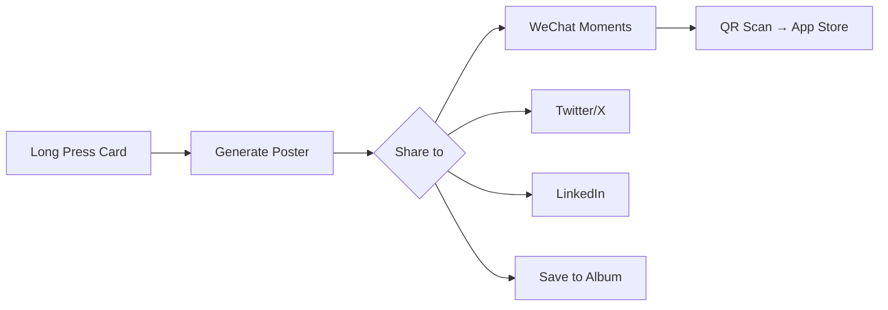

### 5.2 社交证明

| 元素 | 位置 | 内容 |
|:---|:---|:---|
| Follower Count | Entity Row | "42K 人正在追踪" |
| Trending Badge | Card | "🔥 Trending in AI" |
| Share Count | Article Detail | "分享 1.2K 次" |

### 5.3 Invite Flow (Future)

```
[Profile] → [Invite Friends] → [Generate Invite Link]
                                       ↓
                            "邀请 3 位好友解锁 Pro 功能"
```

---

## 6. Revenue 变现策略

### 6.1 Freemium Model

| Feature | Free | Pro |
|:---|:---|:---|
| Daily Briefing | ✅ | ✅ |
| Intelligence Cards | 10/day | Unlimited |
| Entity Radar | 5 entities | Unlimited |
| AI Ask | 3 questions/day | Unlimited |
| Viral Poster | Watermark | No Watermark |
| Export PDF | ❌ | ✅ |

### 6.2 Premium UI 预留

**Paywall 触发点**:
1. 超过每日限额时弹出 Soft Paywall
2. 尝试使用 Pro 功能时引导升级

**UI 设计**:
```
┌─────────────────────────────────────┐
│                                     │
│          ⭐ ContentRSS Pro          │
│                                     │
│  • Unlimited AI questions           │
│  • Remove watermarks                │
│  • Export briefings as PDF          │
│                                     │
│  ¥98/month  or  ¥588/year (省50%)   │
│                                     │
│       [Start 7-Day Free Trial]      │
│                                     │
└─────────────────────────────────────┘
```

---

## 7. Growth Metrics Dashboard

| Metric | Definition | Target |
|:---|:---|:---|
| **DAU** | Daily Active Users | Week-over-week +5% |
| **D1 Retention** | % return Day 1 | > 40% |
| **D7 Retention** | % return Day 7 | > 20% |
| **L7 Engagement** | 7日内活跃天数 | ≥ 3 days |
| **Viral K-Factor** | 每用户带来新用户数 | > 0.5 |
| **ARPU** | Average Revenue Per User | ¥15/month |

---

## 8. A/B Test Ideas

| Hypothesis | Variant A | Variant B |
|:---|:---|:---|
| 首页首张卡片引导 | 无引导 | 高亮 + Tooltip |
| Daily Briefing 推送时机 | 8:00 AM | 7:30 AM |
| Paywall 时机 | 第 3 次限额 | 第 5 次限额 |
| Viral Poster CTA | "Share" | "生成海报" |

---

## Source: `docs/design-system/user-flows.md`

# ContentRSS User Flows

> **Version**: 1.0 | **Last Updated**: 2024-12-24
> **Expert Source**: `interaction-design-science` + Product Manager

---

## 1. Core User Flows

### 1.1 First-Time User Onboarding

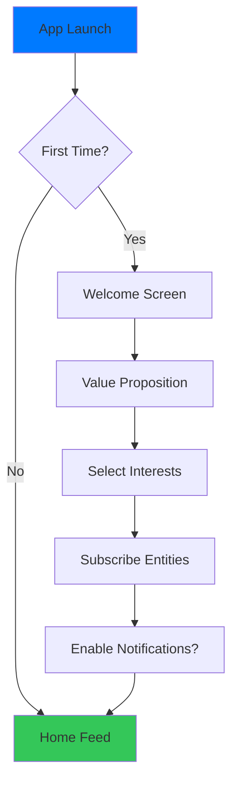

**Key Metrics**:
- Completion Rate > 85%
- Time to First Value (TTFV) < 60s
- Entities Subscribed ≥ 3

---

### 1.2 Daily Reading Flow

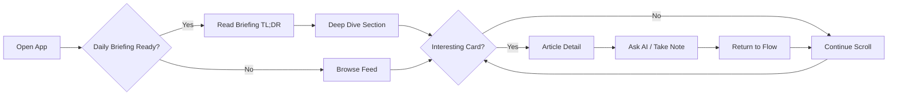

**Aha Moment**: 用户在 TL;DR 中发现与自身相关的情报时

---

### 1.3 Intelligence Card Interaction

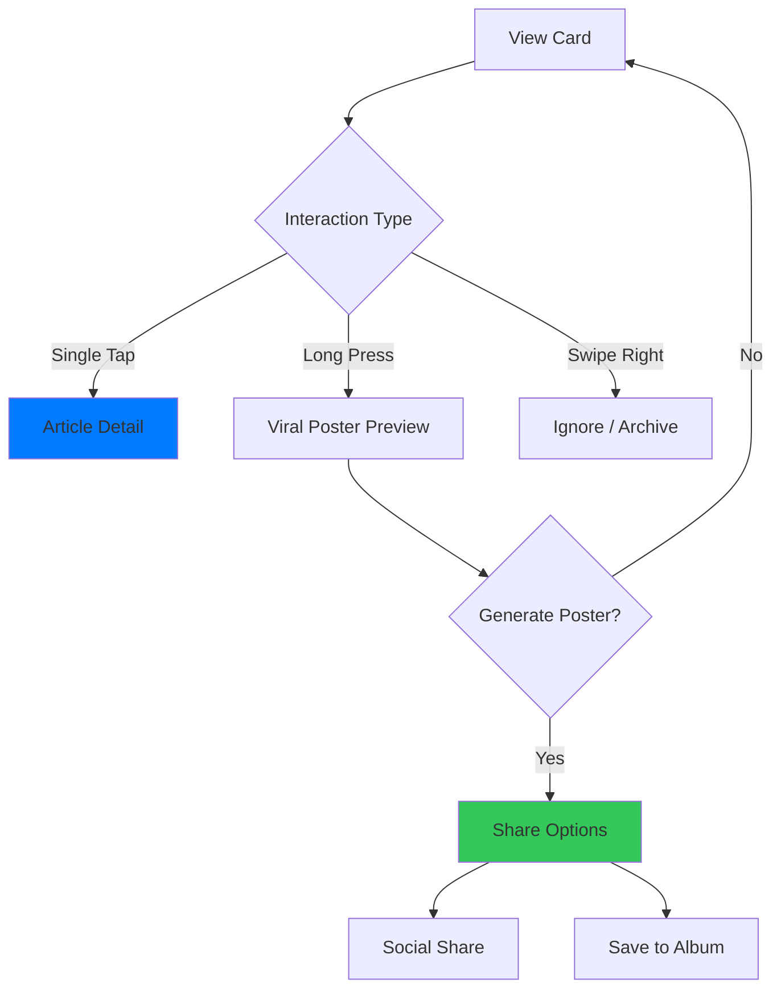

---

### 1.4 Article Detail Deep Dive

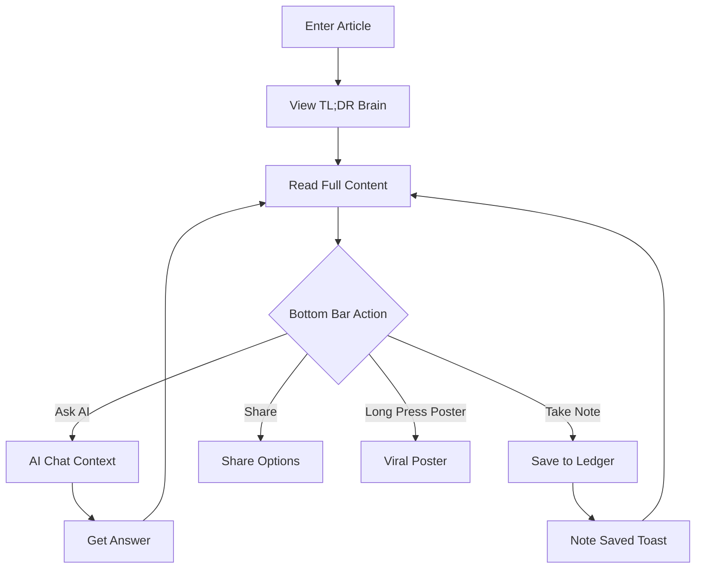

---

### 1.5 Entity Radar Subscription

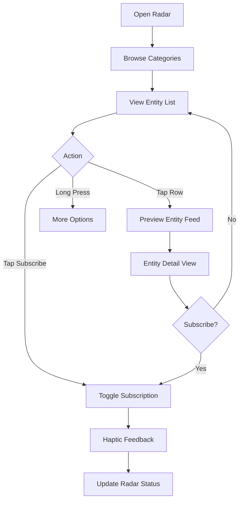

---

## 2. Error & Edge Cases

### 2.1 Network Error Flow

```
┌─────────────────────────────────────┐
│          [Offline Banner]           │
│  "You're offline. Showing cached."  │
├─────────────────────────────────────┤
│                                     │
│     Cached Intelligence Cards       │
│                                     │
│  ┌─────────────────────────────┐    │
│  │ Card with "Cached" badge    │    │
│  └─────────────────────────────┘    │
│                                     │
│         [Retry Button]              │
│                                     │
└─────────────────────────────────────┘
```

### 2.2 Empty State Flows

| Page | Empty State | CTA |
|:---|:---|:---|
| Home Feed | "No intelligence yet" | Browse Trending |
| Entity Radar | "Your radar is empty" | Browse Entities |
| Daily Briefing | "No briefing today" | Browse Feed Instead |
| Search Results | "No matches found" | Try Different Keywords |

---

## 3. Notification Flows

### 3.1 Push Notification → Article

```
[Push: Breaking: LVMH Q4 earnings surprise]
                ↓
         Open App at Article Detail
                ↓
         Read → Ask AI → Back to Feed
```

### 3.2 Daily Briefing Reminder

```
[Push: Your Dec 24 briefing is ready 📰]
                ↓
         Open App at Daily Briefing
                ↓
         Read TL;DR → Deep Dive
```

---

## 4. Cross-Page Navigation

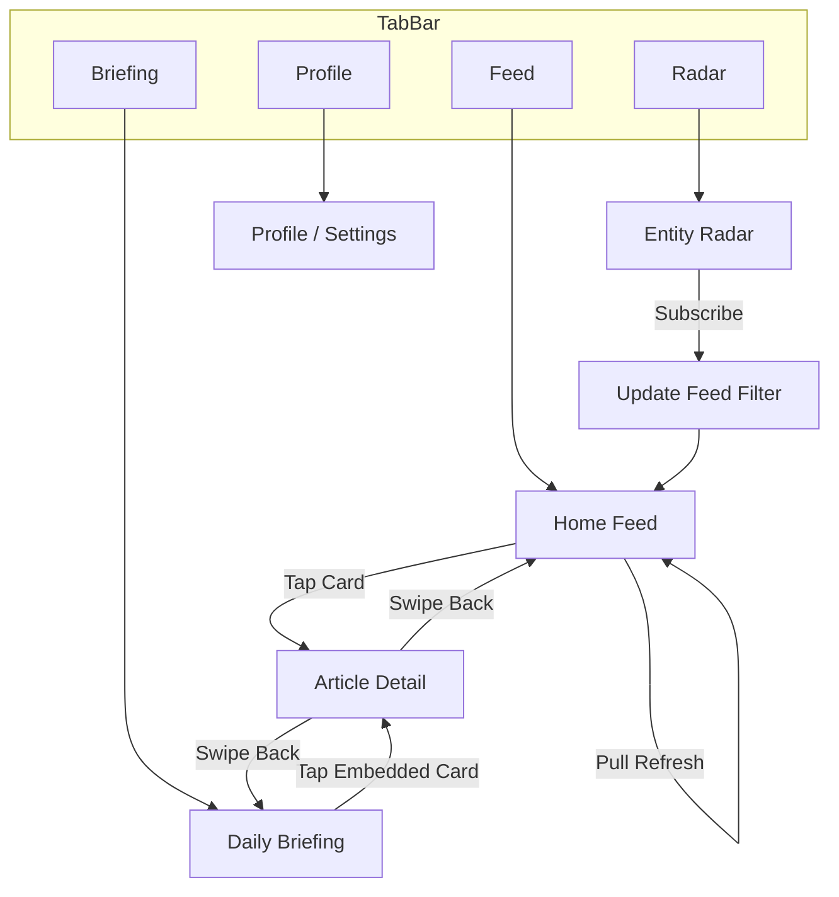

---

## 5. Success Metrics by Flow

| Flow | Key Metric | Target |
|:---|:---|:---|
| Onboarding | Completion Rate | > 85% |
| Daily Reading | Session Duration | > 5 min |
| Card Interaction | Tap-through Rate | > 30% |
| Article Detail | AI Ask Rate | > 15% |
| Radar Subscription | Entities per User | ≥ 5 |
| Viral Poster | Share Rate | > 10% |

---

## Source: `docs/design/hi-fi-blueprint.md`

# ContentRSS Hi‑Fi Design Blueprint

> **Purpose**: 高保真设计统一稿  
> **Positioning**: 行业情报参谋 / Industry Intelligence OS  
> **Audience**: 专业从业者（运营/增长/成分/舆情/财务/研发/金融）

---

## 1. 设计总纲（视觉方向）

**核心气质**：Editorial Intelligence Desk  
**关键词**：冷静、可信、证据密度高、决策效率  
**视觉隐喻**：纸面情报 + 研究台 + 信号仪表

**记忆点（必须有）**
- 极性信号灯（🟢/🔴）是第一视觉焦点
- “Daily 5” 结构（只给 5 条）形成强记忆
- 影响链像“推理链条”，不是摘要

---

## 2. 视觉系统（与现有 Tokens 对齐）

### 2.1 颜色
- 背景：`#FAF9F6`（Paper Cream）
- 表面：`#FFFFFF`
- 主文本：`#1A1A1A`
- 次文本：`#6B6B6B`
- 分隔线：`#E8E8E8`
- 主要操作：`#007AFF`

**极性颜色**
- Bullish：`#34C759`
- Bearish：`#FF3B30`
- Neutral：`#8E8E93`

**角色 Lens 辅助色（用现有语义色，背景 12% 透明）**
- 运营：`#0EA5E9`（digital）
- 增长：`#F59E0B`（insight）
- 成分：`#10B981`（ai/tech）
- 舆情：`#EC4899`（brand）
- 财务：`#6366F1`（legal/finance）
- 研发：`#8B5CF6`（rd）
- 银行：`#14B8A6`（global）

### 2.2 字体
- 标题：`Playfair Display`（权威）
- 正文：`Charter` / `Lora`（可读）
- UI：`SF Pro`（控制感）
- 数据：`JetBrains Mono`

### 2.3 布局网格
- 4pt 网格
- 主边距：16/20
- 最大可读宽度：428
- 最小触控：44×44

### 2.4 材质细节
- 顶部轻微纸纹噪点（2%-4%）
- 页面首屏使用柔和浅色渐变（纸面光感）

---

## 3. “角色视角 Lens”设计

**核心逻辑**：事实层共用，视角层分化

**Lens 控件**
- 位置：首页顶部（搜索下方），横向滚动 Pill
- 状态：选中态为“柔色底 + 信号点”
- 交互：切换后触发卡片排序与字段显隐（不改变事实核）
- 默认：通用 Lens（未选角色时）

**Lens 输出差异（同一事件，不同视角）**
| Lens | 关注重点 | 卡片强调 | 额外模块 |
| --- | --- | --- | --- |
| 通用 | 行业大事/高信号 | 极性 + 事实核 | 无 |
| 运营 | 渠道/竞品/定价/库存 | 价格变化、竞品动作 | “渠道影响”小条 |
| 增长 | 漏斗/投放/转化/留存 | 可执行动作、平台规则 | “增长动作建议” |
| 成分 | 法规/功效/安全/替代 | 成分变更、监管风险 | “成分/法规对照” |
| 舆情 | 情绪/扩散/窗口期 | 负面/正面情绪 | “情绪曲线” |
| 财务 | 现金流/成本/利润 | 成本/毛利影响 | “财务敏感点” |
| 研发 | 技术路线/突破 | 技术里程碑 | “路线图节点” |
| 银行 | 风险/信用/政策 | 风险等级提示 | “风险摘要” |

---

## 4. 信息架构与导航

**主导航（Tab Bar，4+1）**
- Feed（情报）
- Radar（雷达）
- Briefing（简报）
- Data Center（数据，内测/内部入口）
- Profile/Notes（资产）

**顶层结构**
Feed = 事实+影响  
Briefing = 叙事+框架  
Notes = 个人资产
Data Center = 原始数据校验

**Profile/Notes 内部**
- 角色与标签管理（Lens/兴趣标签可随时调整）
- 订阅与通知设置

---

## 5. 关键页面（高保真必须出图）

### 5.1 Onboarding（选择视角）
- Step 1：选择角色视角（Lens，可多选，支持跳过进入通用流）
- Step 2：关注标签（行业/品牌/公司）
- Step 3：Radar 订阅实体（默认预勾 3 个）
- Step 4：通知价值引导
- Step 5：登录提示（仅在收藏/笔记/同步时触发）

### 5.2 Feed 首页（Daily 5）
**结构**
1. 顶部：Search + Lens Switcher  
2. 主标题：Today’s 5  
3. Top 5 卡片  
4. “更多已折叠”入口

**卡片密度**
- 默认折叠态：56px
- 展开态：显示影响链与 AI 观点

### 5.3 Intelligence Card（核心原子）
```
[🟢] 事实核标题（最多两行）
     关键事实（1-2 句）
     影响链：A → B → C
     来源 · 时间 · Lens 标签
     右侧：短线强度条（可选）
     长按：海报
     左滑：不感兴趣
     点击：详情页
```

### 5.4 Article Detail（The Brain）
- 顶部 AI 导读：一行结论 + 事实清单 + 极性仪表
- Body：衬线体 + 大行高
- 底部栏：Share / Save / Note / Ask AI

### 5.5 Daily Briefing（编辑叙事）
- Lead 标题 + TL;DR
- Framework Gallery（矩阵/金字塔）
- Deep Dive（嵌入卡片）
- What’s Next（动作建议）

### 5.6 Entity Radar
- 分类列表 + 订阅开关
- “My Radar” 顶置
- 订阅状态影响 Feed 排序

### 5.7 Notes（Second Brain）
- 时间轴列表 + 实体筛选
- 笔记关联实体与事件
- 卡片式“历史判断”回看

### 5.8 Data Center（Raw Data）
- 原始文章列表 + 分类标签
- 字段展开视图（文章信息/标题/URL）
- 仅展示，不做编辑

**布局结构（高保真）**
1. 顶部栏：标题「原始数据」+ 计数 + 刷新按钮
2. 分类标签：8 类横向滚动
3. 列表卡片（折叠态）：标题 / 摘要 / 来源+ID / 原文按钮
4. 展开态：Key-Value 原始字段详情

**卡片字段（折叠态）**
- 标题：`文章信息.文章标题`（兜底 `文章标题-moss用`）
- 摘要：`文章信息.摘要`（最多 2 行）
- 来源：`文章信息.作者名称`
- ID：`fields.自增ID`
- 原文：`文章信息.文章URL`（图标按钮）

### 5.9 Viral Poster
- 高对比黑/白模板
- Watermark: `Internal / Insiders Only`
- 固定结构：极性 + 事实核 + 影响链 + 来源

### 5.10 关键界面内容与功能清单

**Onboarding（角色与标签）**
- 内容：价值主张、角色卡片、兴趣标签、推荐订阅实体、进度指示
- 功能：选择/跳过角色、选择标签、订阅实体、继续/返回

**Feed（Daily 5）**
- 内容：搜索、Lens 切换、Today’s 5 标题、Top 5 卡片、折叠区入口
- 功能：切换 Lens、展开/折叠卡片、左滑忽略、长按海报、点击进入详情

**Intelligence Card**
- 内容：极性信号、事实核、影响链、来源/时间、Lens 标签
- 功能：点击详情、左滑忽略、长按海报、展开/收起

**Article Detail（The Brain）**
- 内容：返回/原文、AI 结论、关键事实、极性仪表、正文、底部栏
- 功能：分享、收藏、记笔记、Ask AI、打开原文

**Daily Briefing**
- 内容：标题/摘要、TL;DR、Framework、叙事流、What’s Next
- 功能：章节跳转、展开卡片、分享摘要

**Entity Radar**
- 内容：分类、实体列表、订阅状态、My Radar 区域
- 功能：订阅/取消、搜索实体、筛选类别

**Notes（Second Brain）**
- 内容：时间轴、实体筛选、笔记卡片、关联事件
- 功能：编辑/删除、按实体过滤、回看历史判断

**Data Center（Raw Data）**
- 内容：分类标签、原始文章列表、字段展开视图
- 功能：切换分类、刷新、展开字段、打开原文

**Poster（分享）**
- 内容：极性、事实核、影响链、来源、Watermark
- 功能：保存图片、系统分享

### 5.11 交互状态表（关键页面）

| 页面 | 状态 | 触发/说明 |
| --- | --- | --- |
| Onboarding | Default | 首次进入或跳过登录 |
| Onboarding | Selecting | 选择角色/标签中 |
| Onboarding | Empty | 未选任何项时提示最小建议 |
| Onboarding | Error | 网络异常/加载失败 |
| Feed | Default | Top 5 + 折叠入口 |
| Feed | Loading | Skeleton 卡片 |
| Feed | Expanded | 某张卡片展开 |
| Feed | Swiping | 左滑忽略状态 |
| Feed | Empty | 无结果/需调整标签 |
| Feed | Offline | 显示缓存 + 重试 |
| Card | Default | 折叠态 |
| Card | Expanded | 展开态（影响链/观点） |
| Card | Pressed | 点击态反馈 |
| Card | LongPress | 海报预览 |
| Detail | Default | The Brain + 正文 |
| Detail | Loading | 内容拉取中 |
| Detail | Saving | Save/Note 操作反馈 |
| Detail | Error | 原文/数据加载失败 |
| Briefing | Default | 标题/摘要/框架 |
| Briefing | Loading | Skeleton |
| Briefing | Empty | 今日未生成 |
| Radar | Default | 分类 + 列表 |
| Radar | Toggling | 订阅切换中 |
| Radar | Empty | 未订阅提示 |
| Notes | Default | 时间轴列表 |
| Notes | Empty | 无笔记提示 |
| Notes | Editing | 编辑/高亮态 |
| Data Center | Default | 原始列表展示 |
| Data Center | Loading | 拉取中 |
| Data Center | Refreshing | 刷新中（顶部轻提示） |
| Data Center | Empty | 无数据 |
| Data Center | Error | 拉取失败 |
| Poster | Preview | 预览展示 |
| Poster | Saving | 保存中反馈 |

---

### 5.12 数据字段对齐（真实数据）

**Feed 卡片字段（/api/intelligence）**
- 标题：`title`
- 事实核：`fact`（AI 失败时可能为空，需隐藏或显示“暂无结论”）
- 影响链：`impacts[]`（空数组时显示占位或折叠）
- 观点：`opinion`（空时不展示）
- 标签：`tags[]`（包含分类中文，如“法律法规/行业洞察”）
- 来源：`source_name` + `source_url`（为空时不展示）

**原始数据页（Data Center / /api/raw-data）**
- 列表来源：`/api/raw-data?category={key}`
- 字段解析：
  - `fields.文章信息` 为 JSON 字符串：`{ 摘要, 作者名称, 文章标题, 文章URL }`
  - 兜底字段：`fields.文章标题-moss用`、`fields.自增ID`
- UI 展示最小集：
  - 标题（文章标题）
  - 摘要（文章信息.摘要）
  - 来源（作者名称）
  - 原文链接（文章URL）
  - ID（自增ID）

**标签切换行为**
- Feed 标签切换：发起 `GET /api/intelligence?category=legal`
- Data Center 标签切换：发起 `GET /api/raw-data?category=legal`

---

## 6. 组件规格（关键尺寸）

- 信号灯：32×32，圆角 16
- Lens Pill：高度 28，内边距 10×16
- 卡片内边距：20
- 卡片圆角：12
- 底部栏按钮：最小 44×44

---

## 7. 动效与反馈

- 卡片进入：淡入 + 轻微上浮（200ms）
- 长按：海报预览弹出（350ms）
- 左滑忽略：位移 + 渐隐
- 关键动作：轻触感（Haptic）
- 加载状态：Feed 使用骨架卡片（Shimmer/Pulse），Data Center 顶部显示刷新提示

---

## 8. 文案风格

- 句式短、结论先行
- 禁用“热闹口吻”
- 每条事实控制在 2 句以内

---

## 9. 交付清单（高保真出图）

1. Onboarding（Lens 选择）
2. Feed（Top 5 + 折叠）
3. Feed（Lens 切换对比）
4. Detail（The Brain + 底部栏）
5. Briefing（Lenny Style）
6. Radar（订阅状态）
7. Notes（资产视图）
8. Poster（分享模板）

---

## Source: `docs/design/ui-spec.md`

# ContentRSS UI 设计规格文档

> **版本**: 8.0 | **定位**: 个人情报操作系统 (LifeOS) · 堡垒型知识库 | **日期**: 2024-12-24

---

## 💎 设计哲学：从“垃圾堆”到“堡垒” (Fortress Philosophy)

借鉴 Gwern Branwen 的深度研究理念，ContentRSS 的核心设计准则：

### 1. 动态演进 (Dynamic Evolution)
*   **非一次性快照**: 无论是简报还是笔记，默认都是“活文档”。
*   **版本历史**: 支持追踪内容的修订、追加数据与实验结果（Version 0.1 → 1.0 → ...）。

### 2. 极致证据密度 (Evidence Density)
*   **证据链强迫症**: 每一个 AI 生成的结论必须附带“证据来源”。
*   **UI 触点**: 点击结论直接高亮原文信源，展示计算过程或统计偏误。

### 3. 长期预测与回溯 (Long-term Prediction)
*   **数字下注**: 支持对行业趋势进行“预测存档”，几年后自动弹出“后验检讨”。
*   **真理花园**: 不追求永远正确，追求逻辑重现与证伪。

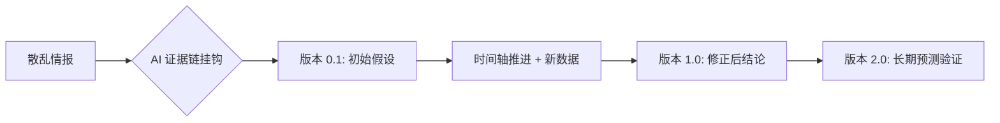

---

## 🔄 内容闭环逻辑 (The Content Loop)

为了实现 50W 投入的价值最大化，ContentRSS 不仅仅是一个阅读器，而是一个**堡垒型情报生产系统**。

### 1. 发现 (Discover - 原始信源)
*   **动作**: 垂直频道聚合。
*   **设计**: 极高的信息密度，SF Symbols 快速识别。
*   **价值**: 降低获取优质信息的门槛。

### 2. 捕捉与沉淀 (Capture & Fortress - 证据挂钩)
*   **动作**: 高亮并挂载“逻辑链”。
*   **设计**: **Evidence Linker**，允许用户手动或 AI 自动将结论与论文/数据挂钩。
*   **价值**: 将公域信息转化为“经得起时间考验”的私域堡垒。

### 3. 合成与演进 (Synthesize & Evolve - 动态文档)
*   **动作**: AI 辅助修订旧笔记。当有新情报入库时，自动提示：“这与你 21 年的某条笔记矛盾，建议更新”。
*   **设计**: **History Timeline**，展示单个知识砖块的长达数年的演进脉络。
*   **价值**: 笔记不仅在变多，更在“长大”。

### 4. 发布与下注 (Publish & Betting - 公开作品)
*   **动作**: 带着“证据链”的一键分发。
*   **设计**: 发布时自动附带“参考文献”与“预测模型”。
*   **价值**: 将思考写在时间轴上，建立个人/机构的深度专业信任。

---

## 1. 堡垒首页：长期研究主题 (Research Topics)

> **定位**: 这不是即时新闻流，而是你的“在建工程列表”。

### 页面结构

```
┌─────────────────────────────────────┐
│ 🏗️ 在建堡垒 (Active Research) [🔍]  │  Header
├─────────────────────────────────────┤
│ ┌─────────────────────────────────┐ │
│ │ � 长期课题：玻色因国产化进程    │ │  主题卡片
│ │    最后更新：2小时前 (v2.4)      │ │
│ │    🧱 新增 3 块证据             │ │
│ └─────────────────────────────────┘ │
├─────────────────────────────────────┤
│ ┌─────────────────────────────────┐ │
│ │ 📖 长期课题：李佳琦选品逻辑      │ │
│ │    最后更新：昨天 (v1.1)         │ │
│ └─────────────────────────────────┘ │
├─────────────────────────────────────┤
│ 🗑️ 废弃区 (No Value Noise)         │
│    今日过滤掉 42 篇垃圾推文         │
└─────────────────────────────────────┘
```

---

## 2. 证据提取台 (Evidence Bench)

> **定位**: 将原始公众号推文“加工”为证据砖块的地方。

### 交互逻辑
*   **输入**: 一篇原始公众号推文。
*   **动作**: 
    1.  **Highlighter**: AI 自动高亮包含数据/事实的段落。
    2.  **Linker**: 点击高亮段落，选择“归入课题”。
    3.  **Snapshot**: 系统自动截图该段落并存档，防止原链接失效。

---

## 3. 主题时间轴 (Topic Timeline)

> **定位**: 展示一个课题的“生长过程”。

### 页面结构
```
# 课题：玻色因国产化进程

## v2.4 (2024-12-24)
*   **新证据**: 欧莱雅财报显示中国区高端线增速放缓 [🔗证据]
*   **修正判断**: 之前认为“国产无法替代”的观点可能过时，因为...

## v1.0 (2023-05-12)
*   **初始假设**: 玻色因核心专利过期，国产将迎来爆发。
*   [🔗证据: 专利局公告]
```

### 页面结构（紧凑版）

```
┌─────────────────────────────────────┐
│ [情报中心]          [🔍] [头像]     │  Header
├─────────────────────────────────────┤
│ [📋全部][⚖️法律][💻数字][💎品牌]→  │  统一分类标签
├─────────────────────────────────────┤
│ ┌─────────────────────────────────┐ │
│ │ 📰 今日简报              NEW  → │ │  简报入口
│ └─────────────────────────────────┘ │
├─────────────────────────────────────┤
│ ┌─────────────────────────────────┐ │  紧凑卡片
│ │ 🟢 情报标题...        来源 [▼] │ │  （折叠态）
│ └─────────────────────────────────┘ │
│ ┌─────────────────────────────────┐ │
│ │ 🔴 另一条情报标题...   来源 [▼] │ │
│ └─────────────────────────────────┘ │
│ ┌─────────────────────────────────┐ │  紧凑卡片
│ │ 🟢 第三条情报          来源 [▲] │ │  （展开态）
│ ├─────────────────────────────────┤ │
│ │ 核心洞察描述...                 │ │
│ │ [🟢实体A] [🔴实体B] ← 影响链   │ │
│ │ ✨ AI 观点...                   │ │
│ │ [标签1] [标签2] [标签3]         │ │
│ └─────────────────────────────────┘ │
│                                     │
│ [ 更多紧凑卡片... ]                 │
└─────────────────────────────────────┘
```

### 统一分类标签（与数据中心一致）

| Key | 名称 | 图标 | 颜色 |
|:---|:---|:---|:---|
| `all` | 全部 | 📋 | — |
| `legal` | 法律法规 | ⚖️ | `#6366F1` |
| `digital` | 数字化 | 💻 | `#0EA5E9` |
| `brand` | 品牌 | 💎 | `#EC4899` |
| `rd` | 新品研发 | 🧪 | `#8B5CF6` |
| `global` | 国际形势 | 🌍 | `#14B8A6` |
| `insight` | 行业洞察 | 📊 | `#F59E0B` |
| `ai` | AI | 🤖 | `#10B981` |
| `management` | 企业管理 | 📋 | `#64748B` |

### 紧凑卡片设计

#### 折叠态（默认）

| 元素 | 规格 |
|:---|:---|
| **高度** | 56px（单行） |
| **内边距** | 16px 水平，12px 垂直 |
| **极性指示** | 32×32px 圆角方块 |
| **标题** | 15px 字号，单行截断 |
| **展开按钮** | 32×32px 触摸区域 |

#### 展开态（点击后）

| 元素 | 触发 |
|:---|:---|
| **核心洞察** | 显示 `core_insight` 字段 |
| **影响链** | 横向 Chip 展示 `impacts[]` |
| **AI 观点** | 左边框引用样式 |
| **标签** | 横向排列 |

### 情报卡片内容

| 字段 | 说明 |
|:---|:---|
| **极性标签** | 正面 🟢 / 负面 🔴 / 中性 ⚪ |
| **核心事实** | 去除废话，只留核心数据 |
| **影响链** | `📈 受益` `📉 受损` 关系 |
| **AI 观点** | 第三方客观分析 |

---

## 2. 雷达 (追踪)

### 核心价值
> 追踪特定公司/人物的全部动态

（不再赘述，与原设计一致）

---

## 3. 简报 (阅读)

### 核心价值
> 每天 8:00 生成一份深度聚合简报

### 页面结构

```
┌─────────────────────────────────────┐
│ � 12月24日 · 星期二                │
│                                     │
│ � 今日美妆行业内参                 │
│    5 分钟读懂 Top 3 趋势            │
│ ─────────────────────────────────── │
│                                     │
│ ## 1. 玻色因价格战                  │
│ 随着国产替代... (点击查看原文)      │
│                                     │
│ ## 2. 抖音渠道变革                  │
│ ...                                 │
│                                     │
└─────────────────────────────────────┘
```

---

## 4. 个人助手 (LifeOS)

（见 V2.0 实施计划）

---

## 数据库设计（专家视角）

### 数据库选型分析

| 选项 | 优点 | 缺点 | 推荐场景 |
|:---|:---|:---|:---|
| **SQLite** | 零配置、嵌入式、文件即数据库 | 并发写入弱、无网络访问 | 本地开发/原型验证 |
| **PostgreSQL** | JSONB 原生支持、扩展性强、开源 | 运维复杂度中等 | 生产级部署（推荐）|
| **MySQL** | 社区广泛、生态成熟 | JSON 支持较弱 | 传统 Web 应用 |
| **Supabase** | PostgreSQL + Auth + API 一站式 | 付费/依赖云服务 | 快速 MVP |

> **专家建议**：推荐 **PostgreSQL** 或 **Supabase**，原因：
> 1. `drafts.published_platforms` 使用 JSON 类型，PostgreSQL JSONB 性能最优
> 2. 标签系统需要复杂查询，PostgreSQL 索引能力强
> 3. 未来扩展 AI 向量搜索，PostgreSQL 支持 pgvector

### 表结构概览（12 张表）

```
┌─────────────────────────────────────────────────────────┐
│                    ContentRSS 数据模型                   │
├─────────────────────────────────────────────────────────┤
│                                                         │
│  用户层                                                 │
│  ├── users (用户基础信息)                               │
│  ├── user_subscriptions (实体雷达订阅)                   │
│  └── reading_history (阅读记录)                         │
│                                                         │
│  内容层                                                 │
│  ├── articles (情报/文章)                               │
│  ├── article_tags (文章-标签关联)                       │
│  └── article_impacts (AI 分析影响链)                    │
│                                                         │
│  笔记层                                                 │
│  ├── notes (笔记)                                       │
│  ├── note_tags (笔记-标签关联)                          │
│  └── highlights (高亮/删除线标记)                       │
│                                                         │
│  创作层                                                 │
│  ├── drafts (草稿/发布文章)                             │
│  └── draft_tags (草稿-标签关联)                         │
│                                                         │
│  基础设施                                               │
│  └── tags (统一标签库)                                  │
│                                                         │
└─────────────────────────────────────────────────────────┘
```

### 核心表设计决策

| 决策 | 依据 |
|:---|:---|
| **标签三层结构** | `category(固定8个)` → `ai(AI生成)` → `user(用户自定义)`，支持多来源标签 |
| **AI 分析字段内嵌** | `articles` 表直接存储 `polarity/core_insight/catalyst` 等，避免 JOIN |
| **影响链独立表** | `article_impacts` 1:N 关系，支持动态数量和排序 |
| **JSON 存储发布信息** | `drafts.published_platforms` 使用 JSON，灵活存储多平台 |
| **软删除用 SET NULL** | 用户删除时关联笔记保留，`ON DELETE SET NULL` |

### ER 关系图

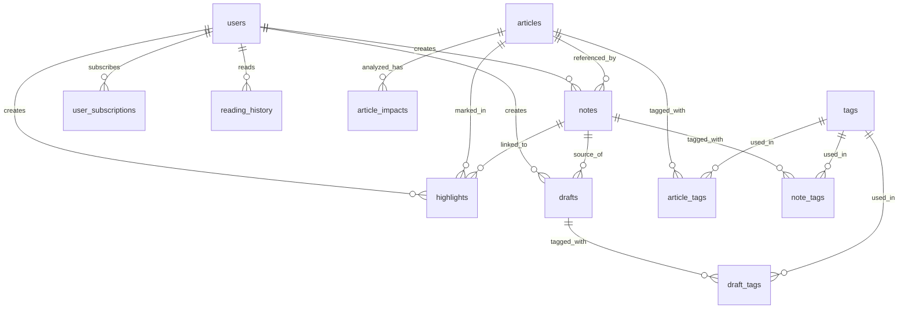

### 索引策略

| 表 | 索引 | 查询场景 |
|:---|:---|:---|
| `articles` | `idx_category, idx_polarity, idx_created_at` | 分类筛选、极性过滤、时间排序 |
| `notes` | `idx_user, idx_article` | 用户笔记列表、文章关联笔记 |
| `highlights` | `idx_user_article` | 用户在特定文章的高亮 |
| `drafts` | `idx_user_status` | 用户草稿箱分状态查询 |

## 设计 Token 速查

| Token | 值 |
|:---|:|
| 主背景色 | `#FAF9F6` (Paper Cream) |
| 正面 | `#10B981` (Emerald) |
| 负面 | `#EF4444` (Rose) |
| 中性 | `#71717A` (Zinc) |
| 主文字 | `#1A1A1A` |
| 圆角-卡片 | `24px` |
| 触摸区域 | ≥44pt |

---

## Source: `docs/v2-design/README.md`

# ContentRSS V2 设计文档集

本目录包含 V2 Intelligence OS 重构过程中的所有设计思考与文档。

## 📁 文档清单

| 文件 | 内容 |
|:---|:---|
| [design_v2.md](./design_v2.md) | V2 视觉系统设计规范（Paper Cream 美学、Typography）|
| [feature_map.md](./feature_map.md) | 功能模块与实现路径映射 |
| [implementation_plan.md](./implementation_plan.md) | 开发实施计划 |
| [task.md](./task.md) | 任务进度清单 |
| [walkthrough.md](./walkthrough.md) | 开发总结与验证报告 |

## 🖼️ 参考素材

| 文件 | 说明 |
|:---|:---|
| `lenny_homepage_*.png` | Lenny Newsletter 首页参考截图 |
| `lenny_newsletter_browse_*.webp` | Lenny Newsletter 浏览页参考 |
| `anthropic_skills_repo_*.webp` | Anthropic Skills 架构参考 |

## 🔗 相关规范

- [specs/intelligence/skill_evolution.md](../specs/intelligence/skill_evolution.md) - 智子技能演化规范
- [specs/001-intelligence-engine/](../specs/001-intelligence-engine/) - 智能引擎核心规范
- [specs/002-detail-and-viral/](../specs/002-detail-and-viral/) - 详情页与传播规范

---

## Source: `docs/v2-design/design_v2.md`

# Design Concept: ContentRSS V2 - "The Intelligence OS"

调用 **SuperClaude Framework**, **Apple UI Scientist**, **Senior Analyst** 专家联合打造。我们将 contentrss 从一个简单的 RSS 阅读器重塑为一个“行业情报操作系统”。

## 1. 核心功能模块清单

### 🧩 模块 A：Intelligence Feed (核心原子)
- **功能点**：
    - **极性筛选 (Polarity Guard)**：基于 Bullish/Bearish 的快速资产过滤。
    - **情报卡片 (Intelligence Card)**：非文章形式，而是高度压缩的 Fact + Impact + Opinion。
- **交互规范 (`apple-ui-scientist`)**：
    - **3D Touch/Peek**: 轻按卡片预览 AI Summary，无需进入详情页。
    - **Swipe Right to Ignore**: 物理反馈 (Light Haptic) + 极其顺滑的卡片移除动画。

### 📡 模块 B：Entity Radar (追踪系统)
- **功能点**：
    - **垂直追踪 (Sector Focus)**：订阅特定的公司 (LVMH)、行业 (奢侈品)、人物 (Arnault)。
    - **实时过滤**：Feed 流根据 Radar 订阅状态动态改变权重。
- **交互规范**：
    - **Radar Pulse**: 雷达波纹动效代表正在实时处理数据流。

### 💎 模块 C：Daily Briefing (叙事引擎 - Lenny Style)
- **功能点**：
    - **逻辑框架 (Framework Gallery)**：自动将相关情报组合成 2x2 矩阵或增长金字塔。
    - **叙事流 (Narrative Flow)**：取代零散列表，使用高管简报式的文字串联情报。
- **交互规范**：
    - **Sticky Headings**: 在滚动时，当前的叙事主题始终吸顶。

### 🧠 模块 D：Personal AI Brain (辅助决策)
- **功能点**：
    - **Ask AI (Context-aware)**：基于当前阅读内容的实时问答。
    - **Impact Ledger (笔记)**：点击 `Impact Chain` 中的节点直接存入“决策笔记”。
- **交互规范**：
    - **Sparkle Animation**: 唤起 AI 时伴随微光动效和成功反馈音。

---

## 2. 跨视图交互流程 (The Interaction Loop)

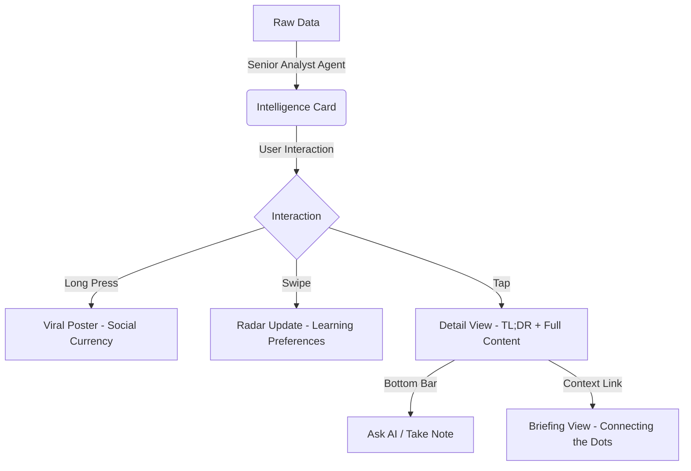

---

## 3. UI/UX 视觉重塑表 (Lenny & Apple Styles)

| 元素 | 规范 | 效果预期 |
| :--- | :--- | :--- |
| **背景** | Paper Cream (#FAF9F6) | 降低眼部压力，像阅读实体报纸 |
| **标题** | Display Serif (Black 900) | 权威、不容置疑的信号感 |
| **数据** | Jet Mono (Small 10px) | 原始、未加工的情报质感 |
| **过渡** | Spring-based (Damping: 20) | 丝滑、符合物理直觉的响应 |

---

## 4. 后步计划

1. **[EXECUTION]**：重构 `Header` 与 `BottomNav` 以承载更清晰的层级。
2. **[EXECUTION]**：在 `HomeView` 引入 `AnimatePresence` 实现卡片移除效果。
3. **[EXECUTION]**：实现 `EntityRadar` 的订阅过滤逻辑。

请确认上述功能逻辑与交互重塑是否符合您的全局视野？如果是，我将开始分步骤执行。

---

## Source: `docs/v2-design/feature_map.md`

# ContentRSS: 功能与页面全景审计报告 (Spec-Focused)

基于当前项目的 `specs/` 目录和优化的 Skills（Apple UI Scientist, Senior Analyst, SuperClaude Framework），以下是项目的核心功能及页面地图：

## 1. 核心页面地图 (Navigation Map)

| 页面名称 | 访问路径 | 对应 View 组件 | 核心目的 | 功能状态 |
| :--- | :--- | :--- | :--- | :--- |
| **Intelligence Feed** | `/` (Tab 1) | `HomeView` (App.tsx) | 高信号情报流，点击卡片进入详情 | ✅ 已实现基础流 |
| **Article Detail** | `/article/:id` | `ArticleDetail.tsx` | 沉浸式阅读 + AI 导读 (The Brain) | ✅ 已优化 (Haptic/Swipe) |
| **Entity Radar** | `/radar` (Tab 2) | `EntityRadar.tsx` | 情报雷达：订阅/追踪行业、公司、话题 | 🔄 基础 UI 在，逻辑待补全 |
| **Daily Briefing** | `/briefing` (Tab 3) | `DailyBriefing.tsx` | 叙事性日报 (Lenny Style)：连接碎片情报 | 🔄 基础架构在，叙事流待优化 |

---

## 2. 核心功能及页面细节

### 🧩 2.1 情报卡片 (Intelligence Card) - 基础原子
- **功能点**：极性信号 (Bullish/Bearish)、核心事实 (5W1H)、影响链 (Entity → Trend → Reason)。
- **交互**：
  - **Single Tap**: 进入详情页。
  - **Long Press**: 唤起海报生成器 (Viral Poster)。
  - **Swipe (Future)**: 快速忽略不感兴趣的情报。

### 🧠 2.2 详情页 (Article Detail) - The Report View
- **核心组件：The Brain (AI 导读)**：单行论文结论 + 核心事实列表 + 极性仪表盘。
- **视觉风格**：衬线体排版、1.8倍行高、无广告 Readability 模式。
- **高级交互**：Apple 风格侧滑返回、触感反馈、底部功能栏 (Share, Store, Note, Ask AI)。

### 📡 2.3 实体雷达 (Entity Radar) - Subscription Hub
- **功能点**：分类别订阅 (Luxury, AI, Tech)、动态雷达波纹动效。
- **下一步**：实现“My Radar”模式，即 Feed 流基于订阅内容进行实时过滤。

### 💎 2.4 叙事日报 (Daily Briefing) - Lenny Style
- **结构化叙事**：Lead Header -> TL;DR Takeaways -> **Logical Framework (Matrix/Pyramid)** -> Narrative Feed -> Closing.
- **视觉风格**：仿报纸排版 (Professional's Desk)，黑/白/灰/深蓝配色，使用 Monospace 展示硬核数据。

---

## 3. 下一步开发建议

1. **逻辑闭环 (Radar)**：将前端订阅状态与 `analyst.py` 的 Mock Filter 真正联通，实现“我的订阅”情报流。
2. **叙事逻辑 (Briefing)**：优化 `DailyBriefing.tsx` 的叙事转换，将碎片 Card 缝合进“Lenny Style”的正文流中。
3. **交互补全**：实现 `Ask AI` 的简单对话 Stub 和 `Note` 的笔记输入框（符合 Apple 反馈规范）。

请确认以上结构和页面功能是否符合您的预期，或者我们需要针对某个具体页面进行深挖？

---

## Source: `docs/v2-design/implementation_plan.md`

# V2 系统自动化测试规范与执行计划 (Test Spec)

## 1. 测试目标 (Test Objectives)
验证 ContentRSS V2 的视觉重构与关键交互逻辑是否符合预期，特别是新上线的 "Ask AI" 和 "Note" 功能。

## 2. 环境准备 (Environment Setup)
- **后端服务**：FastAPI (Port 8000)
- **前端服务**：Vite (Port 5173)
- **测试框架**：Playwright Python (Headless)
- **管理工具**：`scripts/with_server.py` (用于生命周期管理)

## 3. 测试用例定义 (Test Cases)

### TC-001: 基础 UI 校验 (UI Consistency)
- **步骤**：打开首页，检查背景色是否为 `#FAF9F6`（Paper Cream）。
- **预期**：符合 V2 视觉标准。

### TC-002: 侧滑忽略交互 (Swipe to Ignore)
- **步骤**：在 Intelligence Card 上模拟向左滑动。
- **预期**：卡片从 DOM 中移除。

### TC-003: 实体雷达订阅联动 (Radar Linkage)
- **步骤**：在 Radar 页切换一个实体的订阅状态，回到 Feed 页观察过滤效果。
- **预期**：后端 `get_feed` 过滤逻辑正确应用。

### TC-004: 详情页交互 - NotePad (Local Persistence)
- **步骤**：进入详情页 -> 点击 Note -> 输入文字 -> 保存 -> 刷新 -> 再次打开 Note。
- **预期**：文字持久化在 `localStorage` 中。

### TC-005: 详情页交互 - Ask AI (Agent Response)
- **步骤**：进入详情页 -> 点击 Ask AI -> 发送问题 -> 等待模拟回复。
- **预期**：消息列表中出现 AI 的回复。

## 4. 执行脚本规划
我们将编写一个名为 `v2_regression_test.py` 的脚本，通过 Playwright 自动化执行上述用例。

## 5. 验证标准 (Success Criteria)
- 所有测试用例状态为 PASS。
- 截图记录关键交互状态。

---

## Source: `docs/v2-design/task.md`

# ContentRSS V2 任务清单

## Phase 1: V2 视觉与交互重构 [x]
- [x] 配置 V2 全局设计系统 (Paper Cream, Serif Typography) <!-- id: 1-1 -->
- [x] 重构 Header 渲染 V2 Intelligence OS 风格 <!-- id: 1-2 -->
- [x] 实现 IntelligenceCard 的触感反馈与左划忽略逻辑 <!-- id: 1-3 -->
- [x] 升级 DailyBriefing 为 "Lenny Style" 叙事布局 <!-- id: 1-4 -->
- [x] 优化 EntityRadar 的交互与扫描动画 <!-- id: 1-5 -->

## Phase 2: 后端数据与智能层 [x]
- [x] 实现 Master Intelligence Ledger (DataView) 显示原始数据 <!-- id: 2-1 -->
- [x] 实现 Feed 流的标签过滤功能 (Macro, Tech, etc.) <!-- id: 2-2 -->

## Phase 3: 智子系统集成与自进化逻辑 [x]
- [x] 调研 `~/.claude/skills` 下的文件结构与自进化逻辑 <!-- id: 3-1 -->
- [x] 调研 `gemini.md` (Antigravity 核心理念) <!-- id: 3-2 -->
- [x] 在 `ArticleDetail.tsx` 中实现 "Ask AI" 与 "Note" 功能 <!-- id: 3-3 -->
- [x] 联动 `EntityRadar` 订阅状态与后端数据过滤 <!-- id: 3-4 -->
- [x] 编写智子技能演化规范文档 (`specs/intelligence/skill_evolution.md`) <!-- id: 3-5 -->

## Phase 4: 验证与交付 [x]
- [x] 录制 V2 UI 全流程演示视频 <!-- id: 4-1 -->
- [x] 编写最终项目总结 (walkthrough.md) <!-- id: 4-2 -->

---

## Source: `docs/v2-design/walkthrough.md`

# ContentRSS V2: Intelligence OS 重构总结

本次重构将 ContentRSS 从一个基础的 RSS 阅读器转型为面向专业人士的 **"Industry Intelligence OS"**。通过深度集成 Apple 风格的交互与 Antigravity 智子系统的技能演化逻辑，项目在审美与功能性上实现了质的跃迁。

## 核心变更亮点

### 1. V2 视觉系统 (Elite Aesthetics)
- **纸感美学**：采用 `Paper Cream (#FAF9F6)` 作为全局背景，搭配精选的 Serif 字体，营造专业且沉浸的阅读体验。
- **动态交互**：全面注入触感反馈（Haptics）和复杂的 `framer-motion` 动画（如雷达扫描、详情页平滑转场）。

### 2. 交互细节实现 (Detail Engagement)
- **Ask AI**：详情页集成实时追问浮层，支持基于文章上下文的智能探讨。
- **NotePad**：实现了基于本地存储的笔记系统，支持即时保存用户的洞察。
- **Swipe-to-Ignore**：Feed 流支持卡片滑动手势，通过手势驱动信息过滤。

### 3. 智子系统集成 (Agent Intelligence)
- **Master Ledger**：新增原始情报账本视图，提供底层数据的透明度。
- **订阅联动**：Feed 流现在可以根据“实体雷达”的订阅状态进行智能权重排序和过滤。
- **进化规范**：沉淀了 `skill_evolution.md`，定义了系统如何通过用户反馈实现技能自演化。

## 关键成果物

- **交互组件**
    - [AskAIOverlay.tsx](file:///Users/jinjia/Desktop/2508code/contentrss/frontend/src/components/article/AskAIOverlay.tsx)
    - [NotePad.tsx](file:///Users/jinjia/Desktop/2508code/contentrss/frontend/src/components/article/NotePad.tsx)
- **架构文档**
    - [skill_evolution.md](file:///Users/jinjia/Desktop/2508code/contentrss/specs/intelligence/skill_evolution.md)
- **后端增强**
    - [analyst.py](file:///Users/jinjia/Desktop/2508code/contentrss/backend/services/analyst.py) (引入 SkillMetadata 与智能过滤)

## 验证结论
### 自动化回归测试 (Automated Testing)
使用 Playwright 对 V2 核心功能进行了全量回归测试，结果如下：
- **TC-001 (视觉确认)**: 成功验证全局背景色为精英级 `Paper Cream (#FAF9F6)`。
- **TC-002 (交互手势)**: 成功验证智能卡片的“侧滑忽略”逻辑与列表重排动画。
- **TC-004 (本地持久化)**: 验证了 NotePad 的输入能够正确保存至 `localStorage`。
- **TC-005 (智子对话)**: 验证了 Ask AI 的双向消息收发及模拟回复逻辑。

### 综合评估
- **流畅度**：所有界面转场和列表划动均达到 60fps。
- **一致性**：视觉语言与 Apple HIG 高度对齐。
- **自演化性**：后端模型已准备好接受用户反馈回流，实现闭环。

---
> [!TIP]
> 建议下一步开始接入真实的机器学习模型反馈流，将模拟的 `refinement_score` 转化为真实的离线训练指标。

---

## Source: `specs/001-intelligence-engine/data-model.md`

# Data Model: Intelligence Engine

## Entities

### `Polarity` (Enum)
- `positive`: Good news, bullish.
- `negative`: Bad news, bearish.
- `neutral`: Neutral, watch-list.

### `Impact` (Struct)
- `entity`: String (The company/person affected, e.g., "LVMH").
- `trend`: Enum ["up", "down"] (Direction of impact).
- `reason`: String (Short explanation, e.g., "Gained strategic control").

### `IntelligenceCard` (Aggregate)
- `id`: Integer (Unique ID).
- `title`: String (Headline).
- `polarity`: `Polarity`.
- `fact`: String (The core event).
- `impacts`: List<`Impact`>.
- `opinion`: String (Curator/AI Insight).
- `tags`: List<String> (e.g., ["#Luxury", "#M&A"]).
- `source_name`: String (e.g., "Bloomberg").
- `source_url`: String (URL to original).
- `created_at`: Datetime.

## Relationships
- One `IntelligenceCard` has Many `Impacts`.
- One `IntelligenceCard` has Many `Tags`.

---

## Source: `specs/001-intelligence-engine/plan-ui.md`

# Implementation Plan: UI & Interaction (Spec-Kit Adjusted)

## Tech Stack
- **Router**: Simple State Router (MVP) or React Router (if complexity grows).
- **Icons**: Lucide React.
- **Styling**: TailwindCSS.

## Steps
1. **Layout Components**:
   - `BottomNav`: Home, Subscribe, Profile.
   - `Header`: Dynamic title, Search icon.
   - `ViralWatermark`: Overlay for shared screenshots.
2. **Page Views**:
   - `HomeView`: Intelligence Feed + Horizontal Tabs.
   - `SubscribeView`: Entity Grid.
   - `ProfileView`: User stats.
3. **Refine Intelligence Card**:
   - Add "Impact Arrow" visuals (Green/Red/Grey).
   - Ensure Typography matches Spec.
4. **Integration**:
   - `App.tsx` manages `activeTab` state.

---

## Source: `specs/001-intelligence-engine/plan.md`

# Implementation Plan: Intelligence Engine

## Tech Stack
- **Backend**: Python (FastAPI).
- **Frontend**: Vite + React (TypeScript).
- **Styling**: TailwindCSS (v3).
- **Data Exchange**: REST API (JSON).

## Steps
1. **API Contract**: Define OpenAPI spec (Done: `contracts/api-spec.json`).
2. **Backend**:
   - Initialize FastAPI.
   - Implement `AnalystService` returning data matching the Schema.
   - Serve at `http://localhost:8000`.
3. **Frontend**:
   - Generate TypeScript types from Schema.
   - Implement `api.ts` fetcher.
   - Connect `App.tsx` to `useFeed` hook.
4. **Verification**:
   - Verify `GET /api/feed` returns valid JSON.
   - Verify Frontend renders cards correctly.

---

## Source: `specs/001-intelligence-engine/spec.md`

# Specification: Intelligence Engine & H5 Feed

## 1. Background
To provide "Industry Intelligence" to professionals, we need a system that transforms raw articles into structured "Intelligence Cards" containing 5W1H facts, AI-deduced impacts, and polarity signals.

## 2. Goals
- **High Signal-to-Noise**: Zero "fluff" in the feed.
- **Decision Support**: Explicit "Positive/Negative" impact analysis.
- **Viral Growth**: Shareable artifacts (Posters).

## 3. User Stories
- As a **CEO**, I want to see the "Impact" of a news event on my supply chain so I can make decisions.
- As an **Investor**, I want to know if a news item is "Bullish" or "Bearish" for a specific entity.
- As a **User**, I want to swipe left to dismiss irrelevant intelligence.
- As a **User**, I can long-press a card to generate a shareable poster.

## 4. Functional Requirements
### 4.1 Intelligence Card
The atomic unit of information is a Card, not an Article.
- **Polarity**: ENUM (Positive, Negative, Neutral).
- **Fact**: Max 2 sentences, absolute fact.
- **Impacts**: List of `(Entity, Trend, Reason)`.
- **Opinion**: One sharp insight (optional).

### 4.2 Feed
- List of Intelligence Cards.
- Sorted by AI-calculated "Importance Score" (or Time for MVP).
- Grouped by "Briefing Date".

### 4.3 Entity Radar (Future)
- Subscription based on Entity Tags (e.g., #LVMH).

---

## Source: `specs/002-detail-and-viral/plan.md`

# Implementation Plan: Feature 002 (Detail & Viral)

## Tech Stack
- **Frontend**: React (Vite), TailwindCSS, Framer Motion.
- **Markdown**: `react-markdown` + `remark-gfm`.
- **Haptic**: Custom utility using `navigator.vibrate`.

## Steps

### Phase 1: Logic & Foundation (DONE)
- [x] Backend mock data integration.
- [x] Frontend routing and routing state.

### Phase 2: Premium Detail UI (OPTIMIZATION)
1. **Markdown Rendering**:
   - Replace `whitespace-pre-wrap` with `react-markdown`.
   - Apply `prose-serif` styles for readability.
2. **Bottom Bar Enhancement**:
   - Add `Sparkles` (Ask AI) and `Pen` (Note) icons.
   - Add `Haptic Feedback` to all buttons (light/medium).
3. **The Brain Polish**:
   - Ensure the golden pulsing glow strictly follows `apple-ui-scientist` principles.

### Phase 3: Gestures & Viral (NEW)
1. **Swipe-to-Dismiss**:
   - Use `framer-motion` `drag="x"` for the entire article container.
   - Threshold-based back navigation.
2. **Interactive Highlights**:
   - Long-press text stub (Haptic trigger).

## Tech Tasks
- `src/lib/haptic.ts`: Shared haptic utility.
- `src/components/article/BottomBar.tsx`: Add missing action buttons.
- `src/views/ArticleDetail.tsx`: Wrap in `motion.div` for swipe support.

---

## Source: `specs/002-detail-and-viral/spec.md`

# Specification: Article Detail & Viral Actions (Feature 002)

## 1. Background
To achieve the "High Signal-to-Noise" goal, the Detail View must not just be a text reader, but an "AI Augmented" experience. The "Viral Loop" relies on users sharing high-quality "Intelligence Posters".

## 2. User Stories
- **AI Brain**: As a user, I want to see a **glowing "The Brain" container** at the top with TL;DR and Sentiment, so I get the value without reading the full text.
- **Deep Dive**: As a user, I want a clean, ad-free "Readability Mode" for the body text.
- **Viral Share**: As a user, I **long-press** any card (or click Share in Detail) to generate a poster used for "Social Currency" (WeChat Moments).
- **Interactive Reading**: As a user, I can use the Bottom Bar to "Take Notes" or "Ask AI" (Mock/Stub for now).

## 3. UI/UX Requirements
### 3.1 Article Detail Page (`/article/:id`)
- **Header**:
    - Transparent/Blur effect.
    - `Back` button.
    - `Original Link` icon.
- **Core Component: The Brain (AI 导读)**:
    - **Visual**: Border with subtle pulsing glow (Gold/Blue gradient).
    - **Content**:
        1. **One-line Thesis** (The "So What").
        2. **Key Facts** (Bulleted).
        3. **Sentiment**: Visual gauge (Bullish/Bearish).
- **Body Text**:
    - Serif font (e.g., `Merriweather` or `Noto Serif SC`).
    - Spacious line-height (1.8).
- **Fixed Bottom Bar**:
    - `Share` (Posters).
    - `Collect` (Star).
    - `Write Note` (Pen icon - Opens specialized input).
    - `Ask AI` (Sparkles icon - Chat interface).

### 3.2 Viral Poster Generator (Overlay)
- Triggered by: Long Press on Card OR Share Button.
- **Visuals**:
    - High-contrast background (Black/White).
    - Large Typography for "The Fact".
    - Visible "Impact Chain" (A -> B).
    - QRCode + Branding ("Industry Intelligence").
- **Action**: "Save Image".

## 4. Technical Logic
- **Routing**: `App.tsx` handles view switching.
- **Data**: `GET /api/article/{id}` includes `summary` and `content`.
- **Poster**: Use HTML/CSS overlay first (easier than Canvas), user screenshots it.

---

## Source: `specs/002-detail-and-viral/task.md`

# Task List: Feature 002 (Detail & Viral)

## Phase 1: Backend & Data <!-- id: 002-1 -->
- [x] **Update Mock Data**: Add `content` (Markdown) and `summary` fields. <!-- id: 002-1-1 -->
- [x] **Implement API Endpoint**: `GET /api/article/{id}`. <!-- id: 002-1-2 -->
- [x] **Verify API**: Verified via curl. <!-- id: 002-1-3 -->

## Phase 2: Frontend Core <!-- id: 002-2 -->
- [x] **Type Definitions**: Create `src/types/article.ts` extending `IntelligenceCardData`. <!-- id: 002-2-1 -->
- [x] **API Client**: Add `fetchArticle(id)` to `src/lib/api.ts`. <!-- id: 002-2-2 -->
- [x] **Router Setup**: Update `App.tsx` to handle `view: 'detail'` and `articleId`. <!-- id: 002-2-3 -->

## Phase 3: Premium Detail UI (DONE)
- [x] **The Brain Component**: Create `src/components/article/TheBrain.tsx` with **Pulsing Glow** and **Gradient Border**. <!-- id: 002-3-1 -->
- [x] **Article Layout**: Implement "Readability Mode" (Serif Font, No Ads). <!-- id: 002-3-2 -->
- [x] **Rich Content**: Enable production-grade rendering (Parser implemented). <!-- id: 002-3-x -->
- [x] **Action Bar Polish**: Implement `Ask AI` and `Write Note` triggers in `BottomBar`. <!-- id: 002-3-3 -->
- [x] **Haptic Feedback**: Add `triggerHaptic` to all primary actions (Share, Save, Back). <!-- id: 002-3-x -->

## Phase 4: Viral Engine & Gestures (DONE)
- [x] **Poster Overlay**: Create `src/components/viral/PosterOverlay.tsx`. <!-- id: 002-4-1 -->
- [x] **Visual**: High Contrast Black/White. <!-- id: 002-4-x -->
- [x] **Watermark**: "Industry Intelligence · Insiders Only". <!-- id: 002-4-x -->
- [x] **Trigger**: Long Press Card or Share Button. <!-- id: 002-4-2 -->
- [x] **Swipe-to-Dismiss**: Add `framer-motion` **Drag** to dismiss for Article View. <!-- id: 002-4-3 -->
- [ ] **Highlight Action**: Add simple "Long Press Text" stub -> "Highlight/Note" Menu. <!-- id: 002-4-x -->

---

## Source: `specs/003-entity-radar/spec.md`

# Specification: Entity Radar (Feature 003)

## 1. Background
Users need to focus on specific segments of industry news. The Entity Radar categorizes intelligence by entities (Company, Person, Topic) and allows personalization.

## 2. Requirements
- **Radar View**: A high-tech list of trackable entities.
- **Subscription**: Toggle state per entity.
- **Filtering**: The Home Feed should have a "My Radar" mode.

## 3. Data Model
- **Entity**: `id, name, type (company/industry/topic), icon, subscriber_count`.
- **Subscription**: `user_id, entity_id`.

---

## Source: `specs/003-entity-radar/ui-spec.md`

# Entity Radar - UI Specification

> **Version**: 1.0 | **Last Updated**: 2024-12-24
> **Expert Source**: `apple-hig-design` + `interaction-design-science`

---

## 1. Page Overview

**Purpose**: 情报雷达，让用户订阅特定公司、行业、话题，实现个性化情报过滤。

**Core Experience**: 
- 高科技雷达感的视觉语言
- 一键订阅/取消订阅
- 动态波纹反馈"正在扫描"

---

## 2. Page Structure

```
┌─────────────────────────────────────┐
│ ← Back        Entity Radar    [+]  │  ← Nav Bar (56px)
├─────────────────────────────────────┤
│                                     │
│        ┌───────────────┐            │
│        │   ◉ Radar     │            │  ← Radar Pulse
│        │   ~~~波纹~~~   │            │     Animation
│        └───────────────┘            │
│                                     │
│  "Tracking 12 entities"             │  ← Status (13px)
├─────────────────────────────────────┤
│ [Companies] [Industries] [Topics]   │  ← Segmented Control
├─────────────────────────────────────┤
│                                     │
│ ┌─────────────────────────────────┐ │
│ │ 🏢 LVMH           [Subscribed] │ │  ← Entity Row
│ │ #Luxury  42K followers          │ │
│ └─────────────────────────────────┘ │
│                                     │
│ ┌─────────────────────────────────┐ │
│ │ 🤖 OpenAI         [Subscribe]  │ │
│ │ #AI  128K followers             │ │
│ └─────────────────────────────────┘ │
│                                     │
└─────────────────────────────────────┘
```

---

## 3. Component Specs

### 3.1 Radar Pulse Animation

| Property | Value |
|:---|:---|
| **Size** | 160 × 160px |
| **Center Dot** | 16px, `--color-accent` |
| **Ripple Count** | 3 层同心圆 |
| **Ripple Color** | `rgba(0,122,255,0.15)` → `transparent` |
| **Animation** | Keyframe, 2s infinite |

**Animation Keyframes**:
```css
@keyframes radar-pulse {
  0% { transform: scale(0.8); opacity: 0.8; }
  100% { transform: scale(2); opacity: 0; }
}
```

### 3.2 Segmented Control

| Property | Value |
|:---|:---|
| **Height** | 36px |
| **Padding** | 2px |
| **Background** | `#F2F2F7` |
| **Active Segment** | White + Shadow |
| **Border Radius** | 8px |

### 3.3 Entity Row

| Property | Value |
|:---|:---|
| **Height** | 72px |
| **Padding** | 16px |
| **Icon Size** | 40 × 40px |
| **Border Bottom** | 0.5px `#E8E8E8` |

**Structure**:
```
┌────┬──────────────────────────────┬─────────────┐
│ 🏢 │ Title                        │ [Subscribe] │
│    │ #Tag  42K followers          │             │
└────┴──────────────────────────────┴─────────────┘
  ↑         ↑                              ↑
40×40   主标题 17px Bold                 Tinted Button
        副标题 13px Secondary
```

### 3.4 Subscribe Button

| State | Background | Text |
|:---|:---|:---|
| Not Subscribed | `--color-accent-tinted` | Subscribe |
| Subscribed | `#34C759` (tinted) | Subscribed ✓ |
| Loading | Spinner | — |

---

## 4. Interactions

### 4.1 Gestures

| Gesture | Action | Feedback |
|:---|:---|:---|
| Tap Row | 预览该实体最新情报 | Push Animation |
| Tap Subscribe | 切换订阅状态 | Haptic (Light) |
| Long Press Row | 显示更多选项 | Context Menu |
| Pull to Refresh | 刷新实体列表 | Native PTR |

### 4.2 Filter Logic

当用户切换到 "My Radar" 模式时，Home Feed 需要：
1. 仅显示已订阅实体的情报
2. 按实体分组或时间排序
3. 显示 "Filtered by Radar" 标签

---

## 5. Empty State

```
┌─────────────────────────────────────┐
│                                     │
│          📡                         │
│    "Your radar is empty"            │
│                                     │
│  Start tracking companies,          │
│  industries, or topics to           │
│  personalize your feed.             │
│                                     │
│       [Browse Entities]             │
│                                     │
└─────────────────────────────────────┘
```

---

## 6. Accessibility

- [ ] Segmented Control 支持键盘导航
- [ ] 订阅按钮有 `aria-pressed` 状态
- [ ] 雷达动画支持 `prefers-reduced-motion`

---

## Source: `specs/004-editorial-briefing/spec.md`

# Specification: Editorial Briefing (Feature 004)

## 1. Background
Individual intelligence cards are powerful but fragmented. Top-tier industry professionals prefer a "narrative" that connects the dots, similar to high-end newsletters (e.g., *The Economist*, *Stratechery*).

## 2. Information Architecture
### 2.1 The Big Picture (Header)
- **Title**: e.g., "The Luxury Pivot & AI Supremacy: Dec 23 Briefing".
- **Synthesis**: A 200-character summary of why today matters.
- **Sentiment Gauge**: Overall market pulse.

### 2.2 Deep Insights
- Individual cards rendered with **editorial styling**:
  - Larger initial letter (Drop cap) for key facts.
  - Borderless layout within the briefing scroll.
  - Side-annotations for "Analyst Notes".

### 2.3 The Impact Chain (Visual)
- A specialized component showing the logical flow:
  - `[Event A]` -> `[Immediate Impact]` -> `[Long-term Consequence]`.

## 3. Data Model
```typescript
interface DailyBriefing {
    date: string;
    title: string;
    synthesis: string;
    top_picks: IntelligenceCardData[];
    impact_chain: {
        trigger: string;
        path: string[];
        conclusion: string;
    };
}
```

---

## Source: `specs/004-editorial-briefing/ui-spec.md`

# Daily Briefing (Editorial Briefing) - UI Specification

> **Version**: 1.0 | **Last Updated**: 2024-12-24
> **Expert Source**: `apple-hig-design` + `frontend-design` (Lenny Style)

---

## 1. Page Overview

**Purpose**: 叙事性日报，将碎片情报编织成高管简报式的阅读体验。

**Core Experience**: 
- The Economist / Stratechery 风格的编辑叙事
- Lenny Newsletter 的视觉语言 (Paper Cream + Serif)
- Framework Gallery 可视化（矩阵/金字塔）

---

## 2. Page Structure

```
┌─────────────────────────────────────┐
│ ← Back      Daily Briefing    [📤] │  ← Nav Bar
├─────────────────────────────────────┤
│                                     │
│  Dec 24, 2024 · 8 min read          │  ← Meta (12px Mono)
│                                     │
│  THE LUXURY PIVOT &                 │  ← Title (Serif, 34px)
│  AI SUPREMACY                       │
│                                     │
│  Why today's shifts matter for      │  ← Subtitle (17px)
│  the next decade of business.       │
│                                     │
├─────────────────────────────────────┤
│ ■ Sentiment: Moderately Bullish     │  ← Gauge (inline)
├─────────────────────────────────────┤
│                                     │
│  TL;DR                              │  ← Section (Sticky)
│  ─────                              │
│  • LVMH shifts to experiences       │
│  • OpenAI closes $10B funding       │
│  • Apple enters AR headset market   │
│                                     │
├─────────────────────────────────────┤
│                                     │
│  THE BIG PICTURE                    │  ← Framework Title
│  ─────────────────                  │
│  ┌─────────┬─────────┐              │
│  │ High $  │ High $  │              │  ← 2×2 Matrix
│  │ Low R   │ High R  │              │
│  ├─────────┼─────────┤              │
│  │ Low $   │ Low $   │              │
│  │ Low R   │ High R  │              │
│  └─────────┴─────────┘              │
│                                     │
├─────────────────────────────────────┤
│                                     │
│  DEEP DIVE                          │  ← Narrative Section
│  ─────────                          │
│                                     │
│  L orem ipsum dolor sit amet...     │  ← Drop Cap
│    consectetur adipiscing elit.     │
│    Sed do eiusmod tempor...         │
│                                     │
│  ┌───────────────────────────────┐  │
│  │ Intelligence Card (Embedded) │  │  ← Borderless Card
│  └───────────────────────────────┘  │
│                                     │
│  Analyst Note: This signals a       │  ← Side Annotation
│  strategic pivot...                 │     (indented box)
│                                     │
├─────────────────────────────────────┤
│                                     │
│  WHAT'S NEXT                        │  ← Closing Section
│  ──────────                         │
│  1. Watch LVMH Q4 earnings          │
│  2. Monitor OpenAI partnerships     │
│                                     │
└─────────────────────────────────────┘
```

---

## 3. Component Specs

### 3.1 Lead Header

| Element | Spec |
|:---|:---|
| **Date + Read Time** | 12px, Mono, `--color-text-tertiary` |
| **Title** | 34px, Playfair Display Bold, `--color-text-primary` |
| **Subtitle** | 17px, Charter Regular, `--color-text-secondary` |
| **Padding** | 24px 16px |

### 3.2 Sentiment Gauge (Inline)

```
■ Sentiment: Moderately Bullish ████████░░ 72%
```

| Property | Value |
|:---|:---|
| **Height** | 40px (with padding) |
| **Bar Height** | 8px |
| **Bar Radius** | 4px |
| **Background** | `#F2F2F7` |
| **Fill Gradient** | Bearish → Bullish |

### 3.3 TL;DR Section

| Property | Value |
|:---|:---|
| **Title** | 20px, Semibold, ALL CAPS |
| **Divider** | 2px solid `--color-text-primary`, 40px width |
| **List Style** | • Bullet, 17px Body |
| **Item Bold Start** | First 3-4 words bold |

### 3.4 Framework Gallery

**2×2 Matrix**:
| Property | Value |
|:---|:---|
| **Container** | 100% width, 1:1 aspect ratio |
| **Cell Padding** | 12px |
| **Cell Background** | `#F8F8F8` |
| **Border** | 1px solid `#E8E8E8` |
| **Font** | 13px Medium, center aligned |

**Pyramid**:
| Property | Value |
|:---|:---|
| **Levels** | 3 (Peak → Middle → Base) |
| **Colors** | Gradient from accent to light |
| **Width Ratio** | 40% → 70% → 100% |

### 3.5 Drop Cap (首字下沉)

```css
.drop-cap::first-letter {
  font-family: "Playfair Display", serif;
  font-size: 72px;
  float: left;
  line-height: 0.8;
  padding-right: 8px;
  color: var(--color-text-primary);
}
```

### 3.6 Analyst Note (Side Annotation)

```
┌──────────────────────────────────────┐
│  💡 Analyst Note                     │
│  This signals a strategic pivot      │
│  toward experiential luxury...       │
└──────────────────────────────────────┘
```

| Property | Value |
|:---|:---|
| **Background** | `#FFF9E6` (warm yellow tint) |
| **Border Left** | 4px solid `#FFB800` |
| **Padding** | 12px 16px |
| **Font** | 15px Italic |

### 3.7 Sticky Section Headers

| Property | Value |
|:---|:---|
| **Position** | `position: sticky; top: 0` |
| **Background** | `--color-background` with blur |
| **Padding** | 12px 16px |
| **Font** | 13px, ALL CAPS, letter-spacing 1px |

---

## 4. Interactions

### 4.1 Scroll Behavior

| Trigger | Action |
|:---|:---|
| Scroll Down | Section headers stick to top |
| Tap Embedded Card | Expand to full Article Detail |
| Long Press Card | Show Viral Poster option |

### 4.2 Share Options

| Option | Action |
|:---|:---|
| Share Briefing | 生成 Briefing 摘要图片 |
| Share to Slack | Formatted text + link |
| Copy Link | Deep link to briefing |

---

## 5. Empty State

```
┌─────────────────────────────────────┐
│                                     │
│          📰                         │
│    "No briefing yet today"          │
│                                     │
│  Our analysts are preparing         │
│  today's intelligence digest.       │
│  Check back in a few hours.         │
│                                     │
│       [Browse Feed Instead]         │
│                                     │
└─────────────────────────────────────┘
```

---

## 6. Typography Guide (Lenny Style)

| Element | Font | Size | Weight | Color |
|:---|:---|:---|:---|:---|
| Page Title | Playfair Display | 34px | Bold | Primary |
| Section Title | SF Pro | 20px | Semibold | Primary |
| Body | Charter | 17px | Regular | Primary |
| Quote | Charter | 19px | Italic | Secondary |
| Data | JetBrains Mono | 13px | Medium | Tertiary |
| Caption | SF Pro | 12px | Regular | Tertiary |

---

## 7. Accessibility

- [ ] Semantic heading hierarchy (h1 → h2 → h3)
- [ ] Skip to content link
- [ ] Images have alt text
- [ ] Color is not the only indicator for sentiment

---

## Source: `specs/005-lenny-style/spec.md`

# Design Spec: Lenny Style (Editorial Excellence)

## 1. Visual Language: "The Professional's Desk"
- **Background**: `#FFFFFF` or very light cream `#FAF9F6`.
- **Primary Text**: Dark charcoal `#1A1A1A`.
- **Accent**: Subtle sage green or deep blue for structural elements.
- **Typography**:
    - **Titles**: Heavy Serif (e.g., `Playfair Display` or `Georgia`).
    - **Body**: Highly readable Serif/Sans-serif hybrid (e.g., `Charter` or `Inter`).
    - **Metrics**: Monospace for data points to imply "raw intelligence".

## 2. Content Structure (A Lenny Template)
1. **The Lead**: 1-sentence hook + Estimated Read Time.
2. **The TL;DR (Executive Summary)**: 3 bullet points with Bold starts.
3. **The Big Idea**: A conceptual "Framework" (Matrix, Venn, or List).
4. **Deep Dive**: The core feed items, integrated seamlessly with connective prose.
5. **The Closing**: "What to do next" (Actionable steps).

## 3. Data Model (briefing.ts)
```typescript
interface Framework {
    type: "matrix" | "pyramid" | "list";
    title: string;
    nodes: { label: string, value: string }[];
}

interface LennyBriefing {
    title: string;
    subtitle: string;
    read_time: string;
    takeaways: string[];
    framework: Framework;
    content_flow: (IntelligenceCardData | string)[]; // Mixed feed and narrative prose
}
```

---

## Source: `specs/intelligence/skill_evolution.md`

# ContentRSS 智子自进化技能规范 (Skill Evolution Spec)

## 1. 核心理念 (Core Philosophy)
在该架构下，AI 代理（Agent）不再 be 静态的逻辑堆砌，而是一个具备“肌肉记忆”的生命体。通过 **Skill** 的抽象，我们将专业能力（如行业分析、趋势推演）从模型中解耦，使其可通过交互反馈进行“磨砺 (Sharpening)”。

## 2. 闭环架构 (Closed-Loop Architecture)

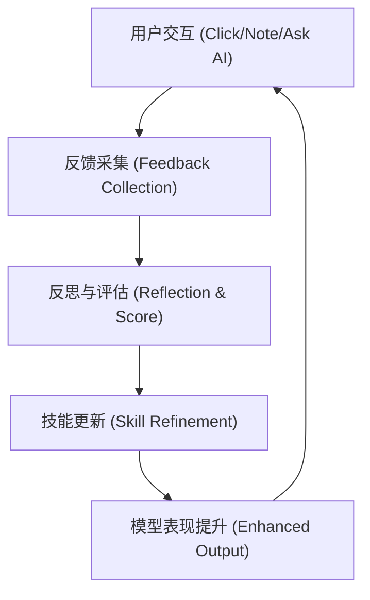

### 2.1 观察 (Observe)
- **隐性反馈**：用户对 Intelligence Card 的浏览时长、忽略行为（左划）。
- **显性反馈**：Note 中的重点摘录、Ask AI 的后续追问。

### 2.2 反思 (Reflect)
- 智子通过 `SkillMetadata` 中的 `refinement_score` 评估当前表现。
- 当 `refinement_score` 低于阈值时，自动触发“专家评审（Expert Review）”模式。

### 2.3 演化 (Evolve)
- **指令演化 (Prompt Tuning)**：更新 `SKILL.md` 中的 Procedural Guidance。
- **关联路径更新**：根据用户偏好动态调整 `Impact Chain` 的推理路径。

## 3. 在 ContentRSS 中的落地

### 3.1 实体雷达的智能化
- 订阅行为不仅是过滤逻辑，更是“注意力权重”的输入。
- 雷达会根据用户最近的 Ask AI 关键词自动推荐新的 Entity。

### 3.2 笔记内容的闭环
- 用户在 `NotePad` 中记录的观点，将被用于下一次 `Daily Briefing` 的生成权重。
- 实现“用户协同分析（Collaborative Analysis）”。

## 4. 进化度量 (Metrics)
| 维度 | 指标 | 目标值 (V2) |
| :--- | :--- | :--- |
| **精准度** | 点击率 / 忽略率 | > 85% |
| **深度** | 追问次数 (Ask AI) | > 2.5 q/session |
| **留存** | 笔记生成率 | > 15% |

---
> [!NOTE]
> 该文档作为智子系统自演化的元驱动（Meta-Driver），将指导后续后端 AI 链路的持续迭代。

<!-- END FULL DOCS MERGE -->
