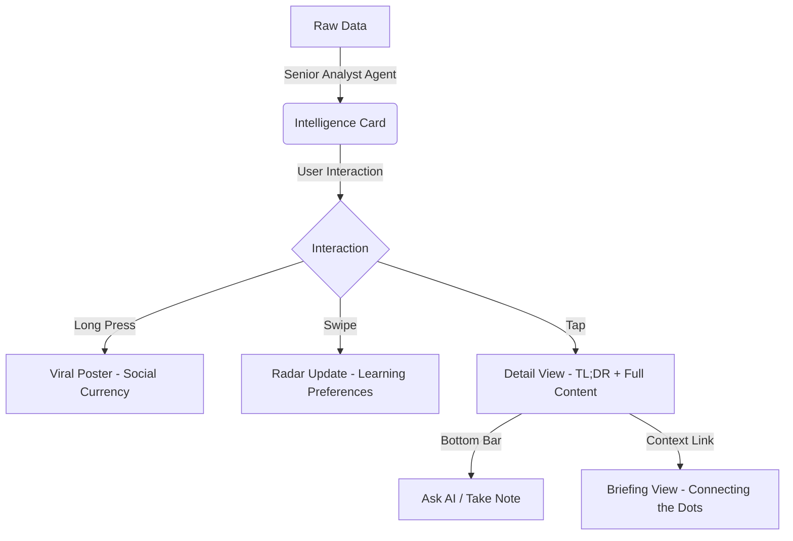

# Design Concept: ContentRSS V2 - "The Intelligence OS"

调用 **SuperClaude Framework**, **Apple UI Scientist**, **Senior Analyst** 专家联合打造。我们将 contentrss 从一个简单的 RSS 阅读器重塑为一个“行业情报操作系统”。

## 1. 核心功能模块清单

### 🧩 模块 A：Intelligence Feed (核心原子)
- **功能点**：
    - **极性筛选 (Polarity Guard)**：基于 Bullish/Bearish 的快速资产过滤。
    - **情报卡片 (Intelligence Card)**：非文章形式，而是高度压缩的 Fact + Impact + Opinion。
- **交互规范 (`apple-ui-scientist`)**：
    - **3D Touch/Peek**: 轻按卡片预览 AI Summary，无需进入详情页。
    - **Swipe Right to Ignore**: 物理反馈 (Light Haptic) + 极其顺滑的卡片移除动画。

### 📡 模块 B：Entity Radar (追踪系统)
- **功能点**：
    - **垂直追踪 (Sector Focus)**：订阅特定的公司 (LVMH)、行业 (奢侈品)、人物 (Arnault)。
    - **实时过滤**：Feed 流根据 Radar 订阅状态动态改变权重。
- **交互规范**：
    - **Radar Pulse**: 雷达波纹动效代表正在实时处理数据流。

### 💎 模块 C：Daily Briefing (叙事引擎 - Lenny Style)
- **功能点**：
    - **逻辑框架 (Framework Gallery)**：自动将相关情报组合成 2x2 矩阵或增长金字塔。
    - **叙事流 (Narrative Flow)**：取代零散列表，使用高管简报式的文字串联情报。
- **交互规范**：
    - **Sticky Headings**: 在滚动时，当前的叙事主题始终吸顶。

### 🧠 模块 D：Personal AI Brain (辅助决策)
- **功能点**：
    - **Ask AI (Context-aware)**：基于当前阅读内容的实时问答。
    - **Impact Ledger (笔记)**：点击 `Impact Chain` 中的节点直接存入“决策笔记”。
- **交互规范**：
    - **Sparkle Animation**: 唤起 AI 时伴随微光动效和成功反馈音。

---

## 2. 跨视图交互流程 (The Interaction Loop)

---

## 3. UI/UX 视觉重塑表 (Lenny & Apple Styles)

| 元素 | 规范 | 效果预期 |
| :--- | :--- | :--- |
| **背景** | Paper Cream (#FAF9F6) | 降低眼部压力，像阅读实体报纸 |
| **标题** | Display Serif (Black 900) | 权威、不容置疑的信号感 |
| **数据** | Jet Mono (Small 10px) | 原始、未加工的情报质感 |
| **过渡** | Spring-based (Damping: 20) | 丝滑、符合物理直觉的响应 |

---

## 4. 后步计划

1. **[EXECUTION]**：重构 `Header` 与 `BottomNav` 以承载更清晰的层级。
2. **[EXECUTION]**：在 `HomeView` 引入 `AnimatePresence` 实现卡片移除效果。
3. **[EXECUTION]**：实现 `EntityRadar` 的订阅过滤逻辑。

请确认上述功能逻辑与交互重塑是否符合您的全局视野？如果是，我将开始分步骤执行。
