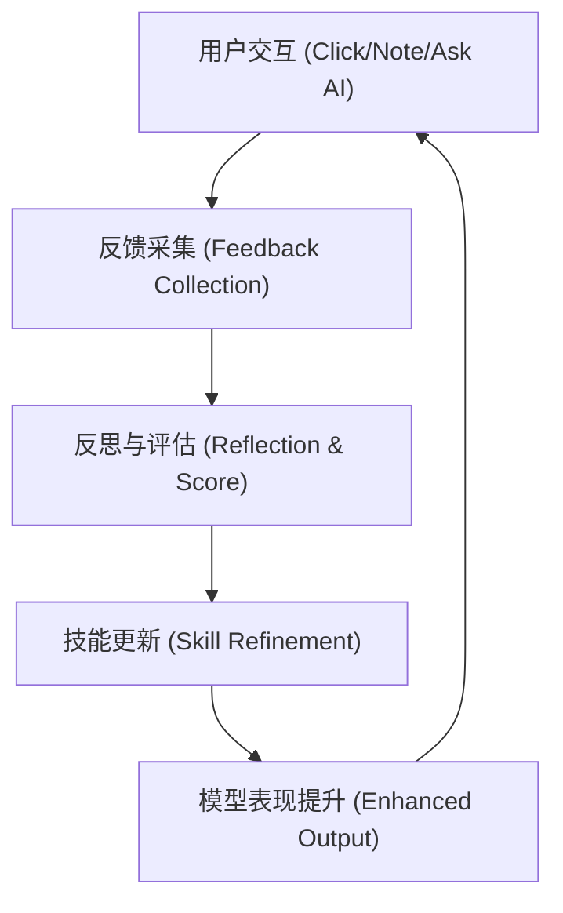

# ContentRSS 智子自进化技能规范 (Skill Evolution Spec)

## 1. 核心理念 (Core Philosophy)
在该架构下，AI 代理（Agent）不再 be 静态的逻辑堆砌，而是一个具备“肌肉记忆”的生命体。通过 **Skill** 的抽象，我们将专业能力（如行业分析、趋势推演）从模型中解耦，使其可通过交互反馈进行“磨砺 (Sharpening)”。

## 2. 闭环架构 (Closed-Loop Architecture)

### 2.1 观察 (Observe)
- **隐性反馈**：用户对 Intelligence Card 的浏览时长、忽略行为（左划）。
- **显性反馈**：Note 中的重点摘录、Ask AI 的后续追问。

### 2.2 反思 (Reflect)
- 智子通过 `SkillMetadata` 中的 `refinement_score` 评估当前表现。
- 当 `refinement_score` 低于阈值时，自动触发“专家评审（Expert Review）”模式。

### 2.3 演化 (Evolve)
- **指令演化 (Prompt Tuning)**：更新 `SKILL.md` 中的 Procedural Guidance。
- **关联路径更新**：根据用户偏好动态调整 `Impact Chain` 的推理路径。

## 3. 在 ContentRSS 中的落地

### 3.1 实体雷达的智能化
- 订阅行为不仅是过滤逻辑，更是“注意力权重”的输入。
- 雷达会根据用户最近的 Ask AI 关键词自动推荐新的 Entity。

### 3.2 笔记内容的闭环
- 用户在 `NotePad` 中记录的观点，将被用于下一次 `Daily Briefing` 的生成权重。
- 实现“用户协同分析（Collaborative Analysis）”。

## 4. 进化度量 (Metrics)
| 维度 | 指标 | 目标值 (V2) |
| :--- | :--- | :--- |
| **精准度** | 点击率 / 忽略率 | > 85% |
| **深度** | 追问次数 (Ask AI) | > 2.5 q/session |
| **留存** | 笔记生成率 | > 15% |

---
> [!NOTE]
> 该文档作为智子系统自演化的元驱动（Meta-Driver），将指导后续后端 AI 链路的持续迭代。
